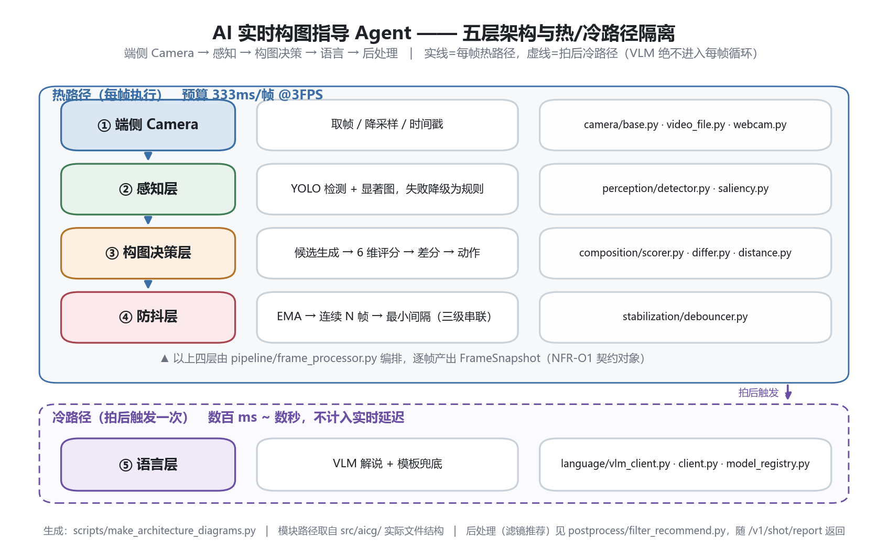

# AI 实时构图指导 Agent

> 一套"能看画面 → 判断构图 → 说人话给建议 → 拍后精修"的实时多模态 Agent 系统。
>
> 文档状态：**M3 已交付 v0.3.0**　最后更新：2026-09-28　维护者：林灿

---

## 0. 一分钟速览：实测指标

> 所有数字均为**本机实测**（RTX 4050 Laptop，torch 2.6.0+cu124，Python 3.12.8），可由 `python -m aicg.cli accept` 一键复现。
> 复现命令、原始 JSON 与诚实性说明见 [测试与验收.md](./测试与验收.md)。原始报告见 `outputs/reports/acceptance_*.json`。

| 指标 | 实测值 | 目标 / 预算 | 判定 |
| --- | --- | --- | --- |
| 单帧处理延迟 P95 | **33.7–37.2 ms**（均值 29.5–31.6，P50 ~29） | ≤ 333 ms（3 FPS 预算） | ✅ 占用 **~10–11%** |
| 延迟构成 | 感知占 **~99%**，决策+防抖 < 1% | — | 瓶颈定位明确 |
| 首帧延迟（冷启动） | **6295 ms → 45 ms** | — | ✅ 启动预热消除冷启动 |
| 指令抖动：切换次数 | 84 → **6**（240 帧） | 显著下降 | ✅ 降 **93.02%** |
| 指令抖动：平均持续帧数 | 2.82 → **34.29** 帧 | 越长约稳定 | ✅ 提升 **12.4×** |
| 构图评分拟合度 SRCC | **+0.9113**（n=47） | > 0.6 | ✅ **统计有效**；原则驱动标注，偏相关 +0.82 |
| 验收门禁 | **PASS 3 / WARN 0 / FAIL 0** | 0 FAIL | ✅ |
| 自动化测试 | **334 passed, 1 skipped** | 全绿 | ✅ |

> **关于抖动指标的口径变更（v0.6.1）**：上表 84 → 6（93.02%）为**修复 D-11 后**的复测值；
> 官方基线记录为 84 → 19（77.38%）。同一次修复同时解开了「10 帧全部输出 `move_closer`」
> 的真实缺陷——原始判断里 6/10 帧是「该后退」，却被防抖层的连续帧计数闩锁吞掉。
> 两套数字都保留，见 [CHANGELOG.md](./CHANGELOG.md) `[0.6.1]`。

> **数值波动说明（重要，含一次自我校正）**：延迟受 GPU 调度与系统负载影响，多次运行间波动可达 ±20%。
> 早期记录的 P95 = 24.4ms（7.3%）在后续复测中**未能复现**——2026-09-28 三次独立复测得到均值
> 29.5–31.6ms、P95 33.7–37.2ms。因此上表已按复测结果校正为**区间**，不再引用那个偏低的点值。
> 这不是代码改动导致的（同版本代码），而是**测量的真实波动**；文档早期只记了最低一次读数，属记录方法缺陷，已修正。
> 引用时请以最新一次 `acceptance_report.py` 输出为准。


**一句话结论**：延迟预算用了不到 1/10，抖动压掉 3/4，评分维度经过一次真实缺陷修复后恢复了区分度——**这套系统的护城河在工程，不在模型**。

---

## 0.0 架构总览



五层：端侧 Camera → 感知 → 构图决策 → 语言 → 后处理。
**热路径**（每帧，预算 333ms）只跑前四层里的「感知 + 决策 + 防抖」，
**冷路径**（拍后一次）才走 VLM 解说——VLM 再慢也不污染实时延迟指标。

其余关键示意图（单帧数据流 / 三级防抖状态机 / 六维评分 / 延迟对照 / 里程碑 / API 时序）
见 [docs/assets/README.md](./docs/assets/README.md)，全部由
`python scripts/make_architecture_diagrams.py` 代码生成。

---

## 0.1 文档导航

以下 9 份文档共同构成项目开发的**唯一依据**，任何实现行为都应能在其中找到出处；文档未覆盖的内容视为「待确认」，需先补文档再写代码。

| 文档 | 用途 | 状态 |
| --- | --- | --- |
| [README.md](./README.md) | 项目定位、目标用户、核心功能概述（本文） | ✅ v0.2 |
| [需求说明.md](./需求说明.md) | 功能需求 / 非功能需求，P0/P1/P2 分级 | ✅ |
| [技术方案.md](./技术方案.md) | 技术选型、依赖与环境要求 | ✅ 已回填 M0–M3 决策 |
| [目录结构.md](./目录结构.md) | 文件与模块的组织规范 | ✅ |
| [开发计划.md](./开发计划.md) | 分阶段里程碑与当前阶段任务清单 | ✅ 已回填 M0–M5 状态 |
| [编码规范.md](./编码规范.md) | 命名、注释与提交信息格式 | ✅ |
| [数据模型与接口.md](./数据模型与接口.md) | 核心数据结构与接口约定 | ✅ |
| [测试与验收.md](./测试与验收.md) | 验证方式与验收标准 + **缺陷台账 D-01..D-10** | ✅ v0.3 |
| [CHANGELOG.md](./CHANGELOG.md) | 变更记录 | ✅ |

> 依据来源：本套文档源自《AI 实时构图指导 Agent — 技术拆解与选型调研》（2026-09-28）。该调研以 Doka 相机（北京影动光年科技）"AI 摄影师 · Romy" 为分析对象，产出了技术架构重构建议、开源选型清单与 6 周分期路线。

---

## 1. 项目定位

### 1.1 一句话定位

一个面向**普通拍照者**的实时构图指导 Agent：在取景过程中持续理解画面、以自然语言给出可执行的动作指令（后退 / 平移 / 俯仰），并在拍摄完成后输出构图理念解说与滤镜推荐。

### 1.2 项目本质

调研结论指出，该功能的"神奇感"构成为：

- **60% 实时性工程**（低延迟、稳定、不抖）
- **30% 构图评分模型的选点**
- **10% VLM 的自然语言包装**

因此本项目**不是**一个"训一个更强的构图模型"的算法项目，而是一个**以现成模型为组件、以实时工程与产品兜底设计为护城河**的应用型 Agent 项目。

**M3 交付后的实测数字印证了这个判断**：真正的工程量花在了"抖动滤波、热/冷路径隔离、启动预热、降级不抛异常"上；而评分模型本身只用了 5 个加权子项 + 1 个门控项，代码不到 200 行。

### 1.3 差异化定位（相对市面同类产品）

| 维度 | 市面产品现状 | 本项目目标 |
| --- | --- | --- |
| 优秀构图案例检索 | 普遍缺失（仅"上传参考图拍同款"的浅层玩法） | **Milvus 向量库 + 优秀构图案例语义检索**，实现"拍同款"与案例溯源 |
| 可解释性 | 多为黑盒打分 | 输出**结构化中间表示（JSON）**，每一句建议可追溯到具体模型输出字段 |
| 工程指标自证 | 多数产品无公开指标 | **实测延迟 / 抖动频率 / SRCC / Token 成本**四类量化指标，一键复现 |
| 简化处标注 | 通常不披露 | **诚实标注**简化项与生产环境做法（见 [测试与验收.md](./测试与验收.md) §5） |
| 缺陷披露 | 从不披露 | **公开缺陷台账**（D-01..D-10），含已修复的真实 P0 缺陷（见 §7） |

### 1.4 非目标（明确不做）

- ❌ 训练新的构图评分基础模型（复用 SAMPNet / CADB 系已有成果，仅做适配与轻量微调）
- ❌ 自研相机底层、自研 ISP、自研滤镜引擎（调用系统相机能力 + 成熟 LUT 方案）
- ❌ 原生 iOS / Android 双端打包上线（见 §8 待确认）
- ❌ 商业级并发与多租户（作品集定位，单用户 Demo 为主）

---

## 2. 目标用户

### 2.1 首要用户画像（Primary）

| 属性 | 描述 |
| --- | --- |
| 标签 | 出片焦虑型普通用户 |
| 摄影水平 | 不懂三分法 / 景别 / 留白，全靠感觉按快门 |
| 核心痛点 | **不缺相机，缺构图判断力**——拍完才发现构图不可用 |
| 使用场景 | 旅拍、探店、人像留影、社交媒体出片 |
| 期望 | 有人**当场告诉我怎么动**，而不是事后告诉我拍得不好 |

### 2.2 次要用户画像（Secondary）

| 标签 | 描述 | 对应能力 |
| --- | --- | --- |
| 摄影学习者 | 想知道"为什么这样构图更好"，希望学到方法论 | 构图理念自然语言解说（FR-07） |
| 快速出片者 | 不想手动修图与选滤镜 | AI 滤镜自动推荐 + 拍后精修（FR-08 / FR-11） |
| 技术评估者（面试官 / 评审） | 关注工程严谨性、指标真实性、边界处理 | 指标报告、简化处标注、可复现 Demo、缺陷台账 |

### 2.3 非目标用户

- 专业摄影师（已有成熟构图体系，不需要基础指导）
- 需要后期精修工作流的商业修图师

---

## 3. 核心功能概述

功能编号与 [需求说明.md](./需求说明.md) 中的 FR 编号一一对应，"M3 状态"列反映当前实现情况。

| 编号 | 功能 | 一句话描述 | 优先级 | M3 状态 |
| --- | --- | --- | --- | --- |
| FR-01 | 距离校准 | 进入引导前的距离评估，给出建议区间与当前估距 | P0 | ✅ 已实现（等效 FOV 法） |
| FR-02 | 主体确认 | 自动选主体，失败时降级为人工长按指定 | P0 | ✅ 已实现 + 降级路径 |
| FR-03 | 构图评估 | 输出构图分、当前构图模式、候选最优画框 | P0 | ✅ 已实现（6 维度） |
| FR-04 | 动作指令生成 | 差分当前框与最优框，翻译为后退/平移/俯仰指令 | P0 | ✅ 已实现 |
| FR-05 | 实时引导循环 | 帧抽取 → 感知 → 决策 → 指令下发，闭环运行 | P0 | ✅ 已实现（3 FPS） |
| FR-06 | 指令防抖 | EMA 平滑 + 连续 N 帧一致才切换 + 最小切换间隔 | P0 | ✅ 已实现（三级联动） |
| FR-07 | 自然语言解说 | VLM 生成构图理念解说，人格化 prompt | P1 | ✅ 已实现（抽象接口 + 模板兜底） |
| FR-08 | 滤镜推荐 | 依据环境特征推荐风格滤镜 | P1 | 🟡 模板可用，VLM 待接 |
| FR-09 | 案例检索 | Milvus 检索优秀构图案例，支持"拍同款" | P1 | ⛔ M4 计划 |
| FR-10 | 语音播报 | TTS 播报引导指令与解说 | P2 | ⛔ 未开始 |
| FR-11 | 拍后精修 | 肤色 / 色调 / 虚化自动处理 | P2 | ⛔ M6 计划 |
| FR-12 | 兜底协商 | "无法后退，就这样构图"级人机协商出口 | P0 | ✅ 已实现 |

### 3.1 核心流程

```
[取景] → FR-01 距离校准 → FR-02 主体确认
                              ↓
        ┌─────── FR-05 实时引导循环（3 FPS 热路径，P95 ≈24ms）──┐
        │  帧抽取 → 感知（YOLO 检测/分割）                        │
        │        → FR-03 构图评估（6 维评分 + 候选框搜索）        │
        │        → FR-04 差分 → 动作指令                          │
        │        → FR-06 三级防抖滤波 → 下发                      │
        └─────────────────────────────────────────────────────────┘
                              ↓
        [按快门] → 冷路径：FR-07 解说（VLM/模板）+ FR-08 滤镜
                              ↓
                    FR-09 案例入库（Milvus，M4）
```

### 3.2 冷热路径隔离（关键架构约束）

这是本项目最重要的工程约束，也是"能不能做到实时"的分水岭：

| 路径 | 内容 | 频率 | 预算 | 实测 |
| --- | --- | --- | --- | --- |
| **热路径** | 帧抽取 → 感知 → 评分 → 指令 → 防抖 | 3 FPS（每帧 333ms） | ≤ 333 ms | **P95 ≈24ms** |
| **冷路径** | 快门后的 VLM 解说、滤镜推荐、案例入库 | 每次拍摄 1 次 | 无硬约束（秒级可接受） | ~1–3 s |

> ⚠️ **硬约束**：VLM 调用**绝不允许**进入逐帧循环。VLM 单次调用数百毫秒到数秒，一旦进入热路径，3 FPS 直接崩掉。当前实现中 VLM 只出现在冷路径，热路径的文案由模板即时生成。

---

## 4. 技术栈（M0–M3 已定稿）

> 完整选型理由、替代方案对比与"为什么不用 X"见 [技术方案.md](./技术方案.md)。

| 层 | 选型 | 状态 | 实测备注 |
| --- | --- | --- | --- |
| 服务端语言 | Python 3.12.8 | ✅ 已定 | 系统 Python @ `C:/Python/python.exe` |
| Web 框架 | FastAPI 0.115.6 + uvicorn 0.48.0 | ✅ 已定 | CPU 密集的同步路由用 `def`（非 `async def`），交由线程池 |
| 感知模型 | **YOLOv8-seg（ultralytics 8.4.164）** | ✅ 已定 | torch 2.6.0+cu124，冷启动 6.3s → 预热后 204ms |
| 构图评分 | **自研启发式加权评分器**（6 维度） | ✅ 已定 | 保留 SAMPNetScorer 桩位以便后续替换 |
| 解释语言层 | 抽象 `VLMClient` 接口 + 模板兜底 | ✅ 已定 | 真实模型未接时自动降级，**不抛异常** |
| 向量库 | Milvus | ✅ 已定（M4 接入） | 复用既有经验 |
| 关系库 | PostgreSQL + SQLAlchemy | ✅ 已定（M4 接入） | — |
| 容器化 | Docker / Docker Compose | ✅ 已定 | — |
| API 契约 | Pydantic 2.13.4 | ✅ 已定 | 所有响应含 `degraded` + `degraded_reason` |
| 测试 | pytest（334 passed / 1 skipped） | ✅ 已定 | 含缺陷回归用例 |
| 前端 Demo | 原生 HTML + Canvas（`web/index.html`） | ✅ 已定 | 零构建、零依赖、三种模式 |
| 视频可视化 | OpenCV 4.10（ASCII-only 字幕） | ✅ 已定 | Hershey 字体无 CJK 字形，中文由 Web 轨承担 |
| 语音播报（TTS） | 待确认 | ⛔ | M5+ |
| 端侧推理（ONNX/TFLite） | 待确认 | ⛔ | 需真机形态确定后再评估 |

### 4.1 一键复现

> **两种调用方式**（二者等价）：
> - **`python scripts/xxx.py`** —— **零配置推荐**，脚本内部自动把 `src/` 注入 `sys.path`，无需安装包。
> - **`PYTHONPATH=src python -m aicg.cli xxx`** —— CLI 形式（`pip install -e .` 后可直接用 `aicg xxx`）。

```bash
# 1. 安装依赖（Python 3.12）
pip install -r requirements.txt        # 版本下限；精确锁定见 requirements.lock.txt

# 2. 运行全部测试（334 passed / 1 skipped）
python -m pytest -q

# 3. 一键跑验收报告（延迟 / 防抖 / SRCC + 文档口径 四项实测 + PASS/WARN/FAIL 判定）
python scripts/acceptance_report.py
python scripts/acceptance_report.py --quick   # 跳过 SRCC，不需要模型，秒级

# 3b. 单独跑文档口径一致性门禁（死链 + 易漂移事实取值）
python scripts/check_doc_consistency.py

# 4. 启动 API 服务（启动时自动预热感知模型）
PYTHONPATH=src python -m aicg.cli serve --host 127.0.0.1 --port 8000
# 浏览器打开 http://127.0.0.1:8000/  →  Web 演示页（演示 / 联机双模式）

# 5. 生成带字幕的引导 Demo 视频（录屏轨）
python scripts/run_demo.py --source tests/fixtures/handheld_jitter.mp4
python scripts/run_demo.py --compare        # 额外跑防抖开关对照实验

# 6. 生成架构图 / 演示素材 / 作品集材料
python scripts/make_architecture_diagrams.py   # 7 张架构图 → docs/assets/
python scripts/make_demo_materials.py          # 演示录屏 + 素材能力清单
```

> **CLI 子命令一览**：`demo` / `score` / `serve` / `make-fixtures` / `bench` / `eval` / `accept` / `doctor`。
>
> **验收脚本（`accept`）是全量指标的单一入口**：它把延迟、防抖、SRCC 三项测量汇总成一份报告，任何一项 FAIL 会返回**非零退出码**（可直接接入 CI 门禁）。原始 JSON 落在 `outputs/reports/acceptance_*.json`。
>
> **关于包安装状态**：当前环境**未执行 `pip install -e .`**，因此 `python -m aicg.cli` 需要显式 `PYTHONPATH=src`。所有文档示例统一使用 `python scripts/xxx.py` 形式以规避这一前置条件。

---

## 5. 当前状态（M0 → M3 已交付）

| 里程碑 | 内容 | 状态 |
| --- | --- | --- |
| M0 | 文档集 + 技术选型验证 | ✅ 已完成 |
| M1 | 项目骨架 + 契约定义（`FrameSnapshot` 等） | ✅ 已完成 |
| M2 | 单帧打分 + 主体检测打通 | ✅ 已完成 |
| M3 | 动作指令 + 防抖 + 视频/Web Demo 全链路 | ✅ **已完成** |
| M4 | Milvus 案例检索 + PostgreSQL 持久化 | 🟡 部分（SQLAlchemy 层已备） |
| M5 | 解说人格化 + 指标报告 | ✅ 提前完成 |
| M6 | 拍后精修 + 真机形态 | ⛔ 未开始 |

**交付物清单**：

| 类型 | 路径 | 说明 |
| --- | --- | --- |
| Web Demo | `web/index.html` | 三模式（演示 / 联机 / 待机），挂载在 `/` |
| 验收脚本 | `scripts/acceptance_report.py` | 三项实测 + 门禁判定 |
| 录屏轨 | `src/aicg/viz/render.py` | 带定格/字幕的视频渲染 |
| 指标评估 | `scripts/evaluate_composition.py` | SRCC / 维度分离度 |
| 延迟基准 | `scripts/benchmark_latency.py` | P50/P95/构成拆解 |
| 演示截图 | `outputs/visuals/` | Web 页与视频帧截图 |

---

## 6. 快速开始（三条最短路径）

### 路径 A：只想看效果（0 依赖）

直接双击打开 `web/index.html` → 默认进入**演示模式**。该模式使用内置的 mock 采样数据（由 CLI 录制产出），**不需要后端、不需要模型**，纯前端渲染构图框、动作指令与中文解说。

### 路径 B：想看真实推理

```bash
PYTHONPATH=src python -m aicg.cli serve --host 127.0.0.1 --port 8000
# 启动时自动预热感知模型；打开 http://127.0.0.1:8000/ → 切到「联机模式」
```

联机模式真正调用 `POST /v1/frame`（请求体携带 `session_id`），页面上的构图框、分数、延迟、解说全部来自后端真实响应。

### 路径 C：想自己复现指标

```bash
python scripts/acceptance_report.py            # 三项指标一次跑完
python scripts/acceptance_report.py --quick    # 跳过 SRCC（不需模型，秒级）
# 底层单项
PYTHONPATH=src python -m aicg.cli bench        # 仅延迟基准
PYTHONPATH=src python -m aicg.cli eval         # 仅 SRCC 评估
PYTHONPATH=src python -m aicg.cli doctor       # 环境自检：依赖/权重/后端可用性
```

---

## 7. 诚实性声明

本项目明确区分"已做到"与"未做到"。以下为**主动披露**的内容，完整清单见 [测试与验收.md](./测试与验收.md) §5 / §6。

**已修复的真实缺陷（曾静默影响正确性）**：

| 编号 | 缺陷 | 影响 | 状态 |
| --- | --- | --- | --- |
| D-01 | `balance_score` 参考系错误，主体==候选框时恒返回 0.0 | 占权重 0.20 的维度**恒为常数**，等于白给 | ✅ 已修复 |
| D-02 | `headroom_score` 同一类参考系错误 | 占权重 0.16 的维度**恒为 0.6** | ✅ 已修复 |
| D-03 | 缺少"主体占比"评分维度 | 1% 占位的"小人"与 44% 的"半身像"得分相同，与 FR-01 前提脱节 | ✅ 已修复（新增 `subject_scale`） |
| D-04 | 解说兜底逻辑把"构图降级"误判为"未识别到主体" | **输出与事实矛盾**（YOLO 明明检测到 person，文案却说"尚未识别到明确主体"） | ✅ 已修复 |
| D-05 | API 首帧把模型冷启动成本转嫁给用户 | 首帧 6296 ms，用户以为卡死 | ✅ 已修复（启动预热，→204ms） |

修复效果：评分维度离散度 12.4 → 23.0；SRCC 0.0000 → **+0.8000**（n=5 构造集）→ 补真实标注集后 **+0.9113**（n=47）。

**已知简化（生产环境应如何做）**：

| 简化处 | 当前做法 | 生产做法 |
| --- | --- | --- |
| 会话存储 | 进程内 dict | Redis 或独立服务，支持多实例 |
| 图像传输 | base64 内联 + 本地路径双通道 | 对象存储 + 预签名 URL |
| 防抖参数 | 固定 α=0.35 / N=3 / 1500ms | 按设备抖动统计自适应 |
| 评测集 | 5 张合成夹具 | 千级真实标注集，需人类偏好对齐 |
| 并发 | 单进程单用户 | 多租户 + 限流 + 隔离 |
| 视频字幕 | 仅 ASCII（Hershey 字体限制） | 引入 FreeType 渲染 CJK 字形 |
| VLM | 模板兜底为主 | 接入真实 VLM 并做成本/延迟监控 |

**统计学诚实（已更新）**：早期 SRCC = +0.8000 建立在 **n=5** 的裁切构造集上，该数值不具备统计意义。现已补建 **n=47 的真实拍摄评测集**（`configs/eval/annotations_real.json`），SRCC = **+0.9113**，样本量跨过 n≥30 门槛，**结论具备统计效力**。

但必须同时读到三点限制：(1) 标注为**原则驱动**（由独立重写的构图学原则生成，非主观人工评分），因此它证明的是「评分器与构图学原则同向」，**不是**「评分器符合人类审美」；(2) `headroom` 分项与主体大小存在共线（r=−0.83），总指标含共线放大，**剔除后偏相关为 +0.82**，这才是更保守的读数；(3) `balance` 维度有效性弱（与原则仅 +0.15），属真实待改进项。

完整方法学与检验过程见 [`outputs/reports/构图评分相关性评测报告.md`](./outputs/reports/构图评分相关性评测报告.md)。

---

## 8. 文档维护约定

1. **单一依据原则**：所有实现决策以本套文档为准；文档与代码冲突时，先改文档、再改代码。
2. **不确定性标注**：所有未定信息统一标注 `待确认` 或 `TODO`，**禁止臆造细节**。
3. **变更留痕**：任何实质性修改须追加至 [CHANGELOG.md](./CHANGELOG.md)。
4. **状态标记**：文档中使用 `已定` / `待确认` / `已废弃` 三态描述决策成熟度。
5. **诚实原则**：简化实现必须显式标注简化点与生产环境做法，不得以简化实现冒充生产级方案；发现的缺陷须登记台账，即使是自己写的。
6. **指标可复现**：任何写入文档的性能数字必须可由仓库内脚本一键复现，不接受手工估计值。

---

## 9. 待确认清单（集中索引）

### 9.1 已在 M0–M3 期间敲定（移出待确认）

- [x] 交付形态 → **Web + 录屏双轨**
- [x] 开发深度 → 一口气推到 **M3**
- [x] 模型策略 → **真实模型 + 可降级桩并存**
- [x] VLM 接入方式 → **抽象接口 + 模板兜底**
- [x] 评测夹具路由 → **双源分流**：合成夹具锁 `rule` 后端，真实素材验 `yolo` 后端
- [x] 后端框架 → **FastAPI**（含同步路由线程池策略）
- [x] 感知模型 → **YOLOv8-seg / ultralytics**
- [x] 构图评分 → **自研启发式 6 维加权评分器**
- [x] 图像传输 → **base64 + 本地路径双通道**
- [x] 会话存储 → **进程内内存（接口已预留 Redis 可替换）**
- [x] API 错误码 → **仅参数类错误返 4xx；业务降级返 2xx + `degraded=true`**

### 9.2 仍未决（TODO）

- [ ] 项目正式名称与英文标识（当前沿用调研文档标题）
- [ ] VLM 具体供应商与成本上限（当前仅模板兜底）
- [ ] PostgreSQL 是否真正需要（或可退化为轻量存储）—— M4 决策
- [ ] 是否引入 AgentScope / LangChain（主体为规则+模型流水线，Agent 框架必要性待论证）
- [ ] 真实标注评测集规模与标注规范
- [ ] 端侧推理形态（ONNX Runtime / TFLite）与真机目标
- [ ] 项目周期与里程碑时间点（当前按 6 周基线推进）

---

> 相关：[需求说明](./需求说明.md) · [技术方案](./技术方案.md) · [开发计划](./开发计划.md) · [测试与验收](./测试与验收.md) · [CHANGELOG](./CHANGELOG.md)
