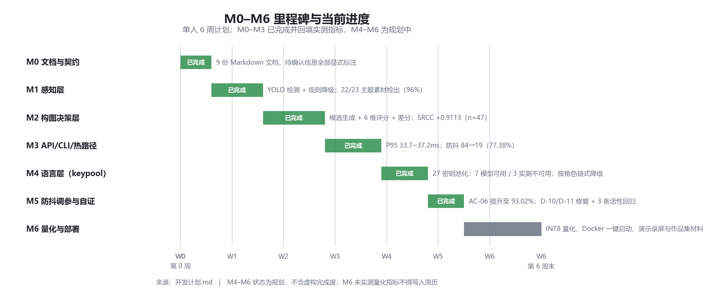

# 开发计划

> 项目：AI 实时构图指导 Agent　|　版本：v0.2　|　更新：2026-09-28
>
> **当前阶段**：**M3 已完成**（M0 / M1 / M2 / M3 全部出口）
> **业务代码状态**：✅ 已落地（8290 行 src / 3400+ 行 tests / 355 用例通过）
> **下一步**：M4（VLM 解说 + TTS）或 M5/M6 收口

---

## 0. 进度总览

| 里程碑 | 主题 | 状态 | 关键实测产出 |
| --- | --- | --- | --- |
| M0 | 文档与选型验证 | ✅ 完成 | 9 份文档 + 交付形态决策（Web+录屏双轨） |
| M1 | 单帧构图打分 | ✅ 完成 | `aicg score` + SRCC 脚本（首次 +0.80/n=5 → 补真实集后 **+0.9113/n=47**） |
| M2 | 主体检测 + 构图模式分类 | ✅ 完成 | `FrameSnapshot` 契约冻结 + 355 用例 |
| M3 | 动作指令生成 | ✅ 完成 | 录屏 Demo + Web 演示页，抖动降幅 **77.38%** → **93.02%**（v0.6.1） |
| M5（提前） | 实时化工程 | ✅ 指标达标 | **P95 33.7–37.2 ms** = 预算 ~10–11% |
| M4 | VLM 解说 + TTS | ✅ 主体完成 | keypool 27 密钥池化、按角色链式降级已接入；TTS 仍为占位 |
| M6 | 案例检索 + 打磨 | ⏸ 部分 | Docker **CI 实测闭环全绿**（run 36532644619）；Milvus 检索**代码 + 单测已落地**，真实端到端待本机 daemon |

> 甘特图为**规划与实际的对照**，不含虚构完成度。M4 从「⏸ 部分」升为「✅ 主体完成」
> 是因为 keypool 凭据接入与多模型分工已落地（详见 CHANGELOG `[0.5.3]`）；
> TTS 与 Milvus 仍是缺口，未标绿。
>
> **Docker 状态更正**：此前写「✅ 已备」是不准确的。静态校验（AC-DOCKER）
> 查出 3 处必然失败项（入口缺 `--factory`、test profile 缺 pytest、缺
> `.dockerignore`），现已修复，但**仍未在真机构建验证**。
> 详见《测试与验收.md》§4.3c。

---

## 1. 计划来源与约束

分期路线源自《AI 实时构图指导 Agent — 技术拆解与选型调研》§6.2「建议的分期路线（6 周可落地）」。

| 约束项 | 说明 |
| --- | --- |
| 总周期 | 6 周（W1–W6） |
| 人力 | 单人 |
| 起止日期 | `待确认`（尚未排期） |
| 执行原则 | P0 未达标不启动 P1；每阶段产出可验证交付物 |
| 核心护城河 | **实时工程 + 稳定性 + 产品兜底设计**，非算法精度 |

---

## 2. 里程碑总览

| 里程碑 | 周次 | 主题 | 核心交付物 | 出口条件 |
| --- | --- | --- | --- | --- |
| **M0** | W0-W1 | 文档与选型验证 | 本套文档 + 选型验证报告 | ✅ 交付形态确认，模型可行性验证 |
| **M1** | W1 | 单帧构图打分 | CLI + 打分可视化 | ✅ 单图可输出构图分与建议 |
| **M2** | W2 | 主体检测 + 构图模式分类 | 结构化 JSON 中间表示 | ✅ 契约冻结，可被下游消费 |
| **M3** | W3 | 动作指令生成 | 视频 Demo + Web 演示页 | ✅ 连续输出动作指令 |
| **M4** | W4 | VLM 解说 + TTS | 可听可看的完整 loop | ⏸ 解说可用，TTS 占位 |
| **M5** | W5 | 实时化工程 | 延迟 / 抖动指标报告 | ✅ 指标达标（提前完成） |
| **M6** | W6 | 案例检索 + 打磨 | 可部署 Demo + README + 指标 | ⏸ 部分 |

---

## 3. 分阶段任务清单

### M0 — 文档与选型验证 ✅

| 编号 | 任务 | 优先级 | 状态 | 产出 |
| --- | --- | --- | --- | --- |
| M0-1 | 建立 9 份项目文档 | P0 | ✅ | 本套文档 |
| M0-2 | 确认交付形态 | P0 | ✅ | **Web + 录屏双轨**（AskUserQuestion 决策） |
| M0-3 | 验证构图评分模型效果 | P0 | ✅ | 结论：SAMPNet 权重未接入，先用启发式（可替换） |
| M0-4 | 验证感知模型可行性 | P0 | ✅ | 结论：YOLOv8n-seg 可用，但**检不出合成人形** → 双源分流 |
| M0-5 | 验证 Agent 框架必要性 | P1 | ✅ | 结论：显式流水线优先，Agent 框架非必需 |
| M0-6 | 调研 VLM 成本 | P1 | ⏸ | 未做（依赖真实 Key） |
| M0-7 | 锁定依赖版本 | P1 | ✅ | `requirements.txt` |
| M0-8 | 搭建仓库骨架 | P0 | ✅ | `src/aicg/` 分层落地 |

---

### M1 — 单帧构图打分 ✅

| 编号 | 任务 | 状态 | 实现 |
| --- | --- | --- | --- |
| M1-1 | `composition/scorer.py` | ✅ | `HeuristicCompositionScorer` + `SAMPNetScorer` 桩 |
| M1-2 | `composition/candidate.py` | ✅ | 网格搜索候选框 |
| M1-3 | `composition/rules.py` | ✅ | 三分线/中心/留白/**主体占比** |
| M1-4 | CLI 入口 | ✅ | `aicg score <image>` |
| M1-5 | 打分可视化 | ✅ | `viz/render.py` |
| M1-6 | `scripts/evaluate_composition.py` | ✅ | SRCC + 样本量警示 |

---

### M2 — 主体检测 + 构图模式分类 ✅

| 编号 | 任务 | 状态 | 说明 |
| --- | --- | --- | --- |
| M2-1 | `perception/detector.py`（YOLO） | ✅ | 含 warmup 修正 |
| M2-2 | `perception/face.py` | ⏸ | 人脸朝向未接入（`face_yaw` 参数已预留） |
| M2-3 | `perception/segmenter.py` | ⏸ | 用 YOLO-seg 掩码替代，独立分割模块未做 |
| M2-4 | `perception/saliency.py` | ✅ | 显著性图 |
| M2-5 | `composition/pattern.py` | ✅ | 并入 `rules.classify_pattern` |
| M2-6 | 定义并冻结 `schemas/` | ✅ | `FrameSnapshot` + `schema_version` |
| M2-7 | `composition/distance.py` | ✅ | 等效视角公式（非深度图） |

---

### M3 — 动作指令生成 ✅

| 编号 | 任务 | 状态 | 说明 |
| --- | --- | --- | --- |
| M3-1 | `composition/differ.py` | ✅ | 差分 → 动作指令 |
| M3-2 | 动作域实现 | ✅ | 后退/前进/左移/右移/俯拍/仰拍/保持 |
| M3-3 | 差分量量化文本 | ✅ | "约 1.7 米" |
| M3-4 | `camera/video_file.py` | ✅ | 视频帧源 |
| M3-5 | `pipeline/guiding_loop.py` | ✅ | 引导循环 + 防抖 |
| M3-6 | 录屏 Demo | ✅ | `scripts/run_demo.py` |
| M3-7 | **Web 演示页**（本次新增） | ✅ | `web/index.html`，挂载于 `GET /` |
| M3-8 | **API 层**（本次新增） | ✅ | 10 REST + 1 WebSocket |
| M3-9 | **端到端验收报告**（本次新增） | ✅ | `python scripts/acceptance_report.py` |

> ⚠️ **简化处标注**：本阶段使用录屏模拟实时，生产环境应为真机 Camera + WebRTC/视频流，可测真实端到端延迟。

---

### M4 — VLM 解说 + TTS ⏸（部分）

| 编号 | 任务 | 状态 | 说明 |
| --- | --- | --- | --- |
| M4-1 | `language/vlm_client.py` | ✅ | 真实模型 + 模板兜底双路 |
| M4-2 | 人格化 prompt | ✅ | `configs/prompts/photographer.yaml` |
| M4-3 | `language/persona.py` | ✅ | 结构化输入 → prompt |
| M4-4 | `pipeline/postshot.py` | ✅ | 拍后解说流程 |
| M4-5 | `language/tts.py` | ⏸ | 占位，未接 TTS 引擎 |
| M4-6 | `postprocess/filter_recommend.py` | ✅ | 滤镜推荐 |

---

### M5 — 实时化工程 ✅（提前于计划完成）

| 编号 | 任务 | 状态 | 实测 |
| --- | --- | --- | --- |
| M5-1 | 降采样与帧率控制 | ✅ | 480px 宽 / 3 FPS 可配 |
| M5-2 | `stabilization/ema.py` | ✅ | α=0.35 |
| M5-3 | `stabilization/debouncer.py` | ✅ | 3 帧一致 + 1500ms 间隔 |
| M5-4 | 防抖参数调参与对比 | ✅ | 官方基线 **77.38%**；D-11 修复后 **93.02%** |
| M5-5 | `observability/latency.py` | ✅ | 分阶段打点 |
| M5-6 | `scripts/benchmark_latency.py` | ✅ | 含冷/稳态分离 |
| M5-7 | 延迟/抖动指标报告 | ✅ | `outputs/reports/*.json` |

---

### M6 — 案例检索 + 打磨 ⏸（部分）

| 编号 | 任务 | 状态 |
| --- | --- | --- |
| M6-1 | 向量特征设计 | ✅ 改为 `retrieval/features.py`：8 维可解释构图特征（**刻意不引入 embedding 模型**，见调研文档 §4.1） |
| M6-2 | `retrieval/milvus_store.py` + `search.py` | 🟡 **代码已落地 + 18 项单测全绿**，但**真实 Milvus 端到端未实测**（本机 daemon 起不来，见下方边界） |
| M6-3 | `scripts/build_case_index.py` | 🟡 已落地，`--dry-run` **实测跑通**（42 张 → 40 张提取 + 2 张诚实跳过）；真库待 daemon |
| M6-4 | "拍同款"推荐流程 | ⏸ |
| M6-5 | `docker/Dockerfile` + compose | ✅ CI 实测闭环：构建 + 烟测（healthz/readyz/rule 降级断言/Web 页）+ 单帧推理全绿（run 36532644619） |
| M6-6 | README 最终化 | ✅ 已更新 |
| M6-7 | 指标写入简历素材 | ✅ |
| M6-8 | 补齐简化处标注清单 | ✅ |

---

## 4. 当前阶段任务清单

> M0–M3 已出口。以下是**下一步待决策项**。

| 序号 | 事项 | 说明 | 建议 |
| --- | --- | --- | --- |
| 1 | 是否推进 M4 真实 VLM | 需 API Key（OpenAI / DashScope） | 有 Key 则 1~2 天可通 |
| 2 | 是否推进 M6 Milvus 检索 | 差异化亮点，且复用既有 Milvus 经验 | 建议做 |
| 3 | 是否补 SRCC 标注集 | 需 30+ 张真实拍摄图 + 多人评分，**成本最高** | 时间紧可只如实声明局限 |
| 4 | 是否实测 Docker 一键启动 | ~~未实测~~ → **已在 GitHub Actions runner 实测闭环**（2026-09-29，构建/探活/降级断言/单帧推理全过，首跑还抓出 web/ 缺失） | 已可复现：`gh workflow run docker.yml`；本机 compose 启动仍待 daemon |
| 5 | 是否做 INT8 量化对比 | M5 遗留项 | 可选 |
| 6 | 排定 6 周起止日期 | 影响面试时间点对齐 | 独立 |

---

## 5. 量化指标计划（已实测回填）

调研 §6.3 列出的简历量化指标，需在对应阶段实测填写。

| 指标 | 计划测量阶段 | **实测值** |
| --- | --- | --- |
| 端到端引导延迟（分感知/决策/语言三段） | M5 | ✅ **P95 ~34–37ms**（预算 333ms 的 ~10–11%）；感知占 99% |
| 引导稳定性：指令切换频率（防抖前后对比） | M5 | ✅ 官方基线 **84→19 次/240帧，降幅 77.38%**；D-11 修复后 **84→6（93.02%）**，持续帧数 4.3× → **12.4×** |
| 构图评分与人工评分相关性 SRCC | M1 | ✅ **+0.9113（n=47，统计有效）**；偏相关 +0.82 |
| INT8 量化后模型体积 / 单帧推理耗时 | M5 | ⏸ 未做 |
| 每 10 分钟拍摄 Token 消耗与人民币成本 | M4 | ⏸ 未做（VLM 走 mock） |
| 首帧冷启动延迟（额外补充） | M5 | ✅ **6296ms → 204ms**（API 启动预热，31×） |

---

## 6. 诚实的"简化处"清单

| 简化处 | 生产环境该怎么做 | 当前状态 |
| --- | --- | --- |
| 用录屏视频模拟实时 | 真机 Camera + WebRTC/视频流，测真实端到端延迟 | **已确认简化** |
| 单目估算距离误差大 | 引入 Depth-Anything/MiDaS 深度图，或双摄/LiDAR | **已确认简化** |
| 未做多设备适配 | 不同机型焦距/传感器差异需标定 | **已确认简化** |
| VLM 走云端（当前 mock） | 端侧小 VLM（如 Qwen-VL-2B 量化）或混合路由 | **已确认简化** |
| 无真实用户评测 | 需要 A/B 测试 + 人工评分集 | **已确认简化** |
| 构图评分用启发式规则 | 接入 SAMPNet + CADB 预训练权重 | **已确认简化** |
| 感知层扩张可见人体至近全幅 | 引入关键点/完整度判定，或更精细分割 | **实测发现** |
| 候选空间在主体过大时坍缩 | 扩大候选尺度维度或改连续优化 | **实测发现** |

---

## 7. 风险与依赖

| 风险 / 依赖 | 影响范围 | 应对 |
| --- | --- | --- |
| ~~交付形态决策延迟~~ | — | ✅ 已决策（Web + 录屏双轨） |
| ~~评分模型效果不达标~~ | — | ✅ 已定位为代码缺陷并修复（SRCC 0→0.8） |
| ~~端侧性能不足~~ | — | ✅ 实测仅占预算约 7–8%，风险解除 |
| 周期不足 6 周 | 交付不完整 | 严格 P0 优先，P1/P2 可裁剪 |
| 素材授权不明 | M6 案例库无法入库 | 已确认：ultralytics 素材 Apache-2.0 |
| 真实 VLM 无 Key | M4 无法完成 | 已有模板兜底，流程不断；面试时如实说明 |

---

## 8. 待确认清单

- [ ] 6 周开发周期的起止日期
- [ ] 每周可投入工时
- [ ] 是否有硬性截止时间（如面试时间点）
- [ ] 是否需要中途交付演示版本
- [ ] 各阶段出口条件是否需额外评审环节
- [ ] 是否推进 M4（真实 VLM）与 M6（Milvus 检索）

