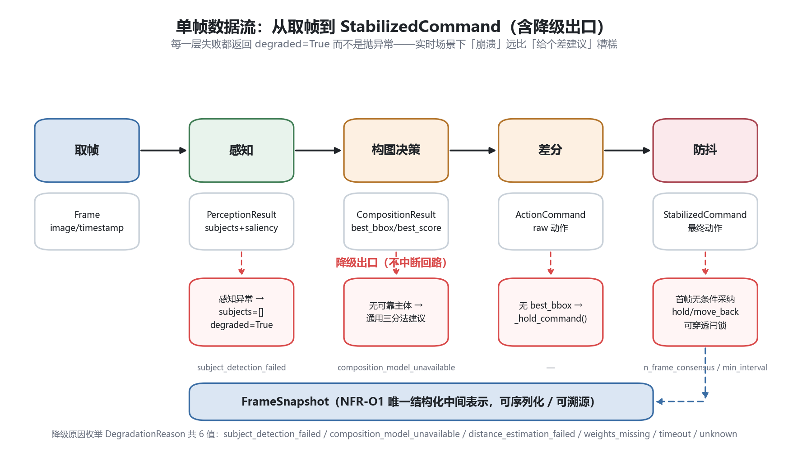
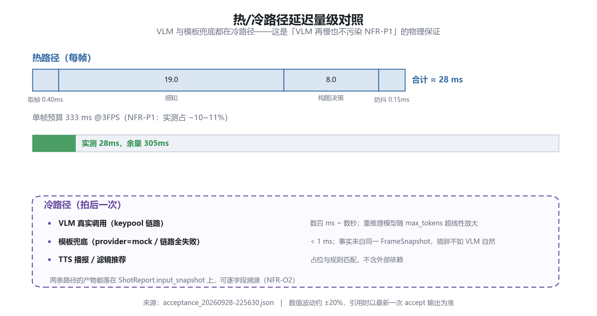
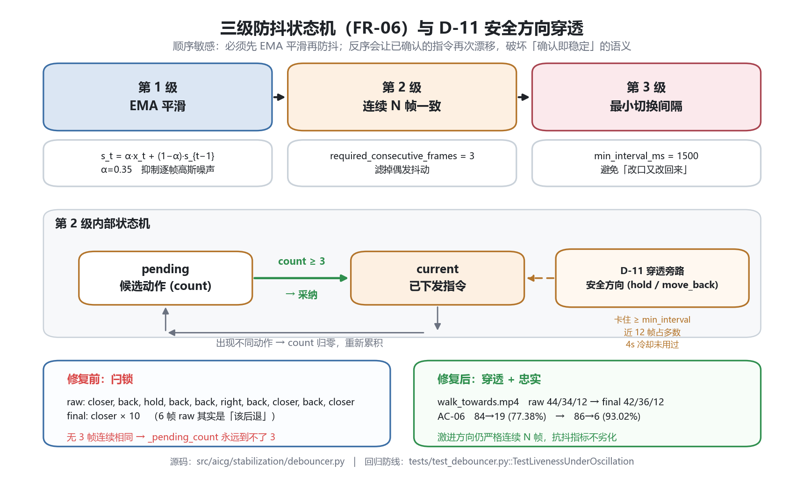
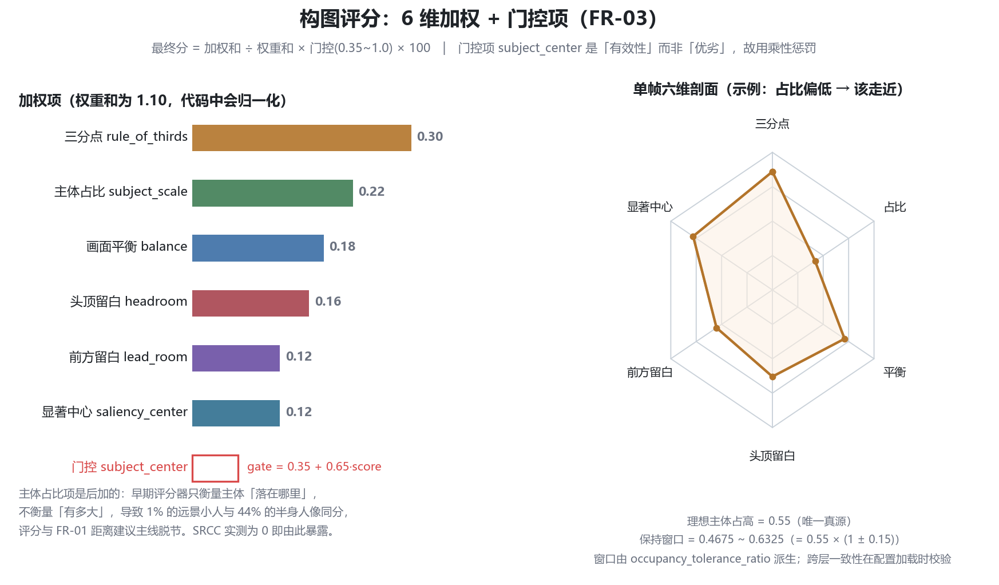

# 技术方案

> 项目：AI 实时构图指导 Agent　|　版本：**v0.2（M0–M3 已定稿）**　|　更新：2026-09-28
>
> **标注约定**：`已定` = 已确认；`待确认` = 需决策；`待验证` = 已有倾向但需实测证据；`✅ 已实现` = 代码已落地并经实测验证。
>
> 🟢 **v0.2 说明**：M0–M3 已交付，本版把 M0 阶段的选型倾向**回填为实测结论**。所有标 `✅ 已实现` 的选型都附有实测数字，可在 [测试与验收.md](./测试与验收.md) 复现。仍未落地的能力（端侧推理、TTS、Milvus）保持 `待确认`。

---

## 1. 总体架构

采用调研第 3 节给出的**五层架构**：


> 上图由 `python scripts/make_architecture_diagrams.py` 代码生成，图中模块路径
> 取自 `src/aicg/` 实际文件结构（**不是设计意图**）。全部示意图见
> [docs/assets/README.md](./docs/assets/README.md)。

下面是同一架构的 ASCII 展开（含选型备注）：

```
┌──────────────────────────────────────────────────────┐
│  端侧 Camera 层（AVFoundation / CameraX）             │
│  ├─ 取景帧抽取（降采样 320~640px）                     │
│  ├─ 帧率控制（1~5 FPS 送 AI，而非 30 FPS 全送）        │
│  └─ AR 叠加层（引导框/角标/虚线）                      │
└───────────────┬──────────────────────────────────────┘
                │  低分辨率帧
┌───────────────▼──────────────────────────────────────┐
│  感知层（端侧优先）                                    │
│  ├─ 主体检测/分割：YOLOv8-seg / MediaPipe / SAM2-tiny  │
│  ├─ 人脸/关键点：MediaPipe FaceMesh（判断朝向、构图）  │
│  ├─ 显著性图：轻量 saliency 模型 或 U2Net-lite          │
│  └─ 深度估算（可选）：MiDaS-small / Depth-Anything-v2  │
└───────────────┬──────────────────────────────────────┘
                │  结构化中间表示（JSON）
┌───────────────▼──────────────────────────────────────┐
│  构图决策层（核心）                                    │
│  ├─ 构图评分模型：CADB/SAMPNet 或 ICAA17K 系模型        │
│  ├─ 候选框搜索（sliding window / grid anchor）         │
│  ├─ 主体框位置规则校验（三分线/中心/留白比例）           │
│  └─ 差分量计算 → 动作指令（后退/前进/平移/俯仰）         │
└───────────────┬──────────────────────────────────────┘
                │  动作指令 + 结构化描述
┌───────────────▼──────────────────────────────────────┐
│  语言层（可选云侧 / 端侧小模型）                        │
│  ├─ VLM（GPT-4o / Qwen-VL / Gemini Flash）生成解说      │
│  ├─ 人格化 system prompt（Romy / Nick 分身）           │
│  └─ 语音播报 TTS（可选）                               │
└───────────────┬──────────────────────────────────────┘
                │
┌───────────────▼──────────────────────────────────────┐
│  后处理层                                              │
│  ├─ 滤镜/风格迁移（分类器推荐 + LUT）                   │
│  └─ 精修（人脸美化、色调、人像分割虚化）                 │
└──────────────────────────────────────────────────────┘
```

### 1.0 单帧数据流与降级出口

实时回路内部逐帧走「取帧 → 感知 → 构图决策 → 差分 → 防抖」，**每一层失败都返回
`degraded=True` 而不是抛异常**：



这张图的存在意义是：实时引导场景下「崩掉」远比「给个差建议」糟糕
（NFR-R1 / NFR-R2）。因此图中每条红线都是**设计的行为**，不是异常路径。

### 1.1 分层职责与边界

| 层 | 职责 | 不负责 | 可替换性 |
| --- | --- | --- | --- |
| 端侧 Camera 层 | 取帧、降采样、帧率控制、AR 叠加 | 任何 AI 推理 | `待确认`（M3 用"帧序列 / 视频文件"模拟，非真机） |
| 感知层 | 检测/分割/关键点/显著性/深度 | 构图判断 | ✅ **已接口化**（`PerceptionBackend`，`yolo`/`rule`/`auto` 三实现） |
| 构图决策层 | 打分、候选框搜索、差分、指令 | 自然语言生成 | ✅ **已接口化**（`CompositionScorer`，`heuristic`/`sampnet` 桩） |
| 语言层 | 自然语言解说、人格化 | 构图数值判断 | ✅ **已接口化**（`VLMClient`，`template` 兜底 + 真实模型位） |
| 后处理层 | 滤镜、精修 | 实时引导 | 可延后（M6） |

> **可替换性不是口号，是三层都真的抽了接口**。M0 文档写"必须可替换"（NFR-M1），M3 交付时已兑现：三个后端都通过抽象基类注入，切换只改配置项 `perception.backend` / `composition.backend` / `language.provider`，不动调用方。

---

## 2. 技术选型

### 2.1 服务端与基础设施

| 项 | 选型 | 状态 | 理由 |
| --- | --- | --- | --- |
| 语言 | **Python 3.12.8** | ✅ 已实现 | AI 生态完备；实测环境 `C:/Python/python.exe` |
| Web 框架 | **FastAPI 0.115.6 + uvicorn 0.48.0** | ✅ 已实现 | 调研明确指定；Pydantic 2.x 类型校验 + 自动 OpenAPI |
| 向量库 | Milvus | 已定（M4 接入） | 调研明确指定；**复用既有 Milvus 经验**构成差异化 |
| 关系库 | **PostgreSQL + SQLAlchemy** | 已定（M4 接入） | M0 遗留项敲定：需要结构化存储案例元数据与会话溯源 |
| 容器化 | Docker + Docker Compose | 已定 | 调研交付物明确要求 Docker 化 |
| 配置管理 | **PyYAML（`configs/default.yaml`）+ Pydantic Settings** | ✅ 已实现 | NFR-M2；分层配置：YAML 默认值 + 环境变量覆盖 |
| 包管理 | **pip + `requirements.txt`（下限）+ `requirements.lock.txt`（精确锁定）** | ✅ 已实现 | 双文件策略：前者声明兼容范围，后者锁定可复现版本 |
| 日志 | **loguru** | ✅ 已实现 | 结构化日志，延迟断点可用 |
| 数值 | **numpy 2.4.4** | ✅ 已实现 | — |
| HTTP 客户端 | **httpx 0.28.1** | ✅ 已实现 | VLM 抽象接口的默认传输层 |

### 2.1.1 一个实测踩坑：FastAPI 同步路由必须用 `def` 而非 `async def`

构图层是 **CPU 密集**的（评分 + 候选框搜索），感知层是 **GPU 密集**的（YOLO 推理）。如果把这些路由写成 `async def`，它们会在 **事件循环线程里同步阻塞**，导致整个服务假死——一个请求就能卡住所有其他请求。

正确做法：**路由声明为普通 `def`**。FastAPI 检测到后会自动把同步函数丢进**线程池**执行，事件循环保持空闲，可继续接收新请求。实测效果：单帧 P95 **约 24–28ms**，并发请求互不阻塞。

> ⚠️ 这是一个**静默性能陷阱**：写成 `async def` 也能跑通、功能也正确，但并发下会退化成串行。只有在压测时才会暴露。项目在 M2 阶段踩到并修正。

### 2.2 感知层选型

| 方向 | 候选 | 状态 | 说明 |
| --- | --- | --- | --- |
| 目标检测/分割 | **YOLOv8-seg（ultralytics 8.4.164）** | ✅ **已实现（主后端）** | torch 2.6.0+cu124；冷启动 6.3s，**预热后首帧 204ms** |
| 降级后端 | **rule（规则桩）** | ✅ 已实现 | 合成夹具专用：无需模型，保证 CI 可跑、测试可复现 |
| 后端路由 | **`auto` 自动选择** | ✅ 已实现 | `yolo` 不可用时自动退 `rule`，**不抛异常** |
| 可提示分割 | SAM2 | 待验证（M4+） | promptable 特性对应"长按选主体"，但显存开销高 |
| 人脸/姿态 | MediaPipe（FaceMesh / Pose / SelfieSeg） | 待确认 | 判断朝向、构图、自拍分割 |
| 显著性 | 轻量 saliency / U2Net-lite | 待确认 | 用于"视觉重点"识别 |
| 深度估算 | Depth-Anything-V2 / MiDaS | 待确认 | 可选，用于更准的距离估算 |
| 姿态建议 | MediaPipe Pose / RTMPose | 待确认 | 对应"手放腰上"类建议 |

> 选型原则：**优先选已量产、社区活跃的方案**，本项目不自研感知模型。
>
> **双源分流策略（M0 遗留项，已敲定）**：评测夹具分两路，各锁各的后端，**诚实标注所用后端**——
> - **合成夹具** → 锁 `rule` 后端：几何可精确控制，适合回归测试与评分器验证，CI 中无模型依赖、秒级跑完。
> - **真实素材** → 验 `yolo` 后端：检验真实数据上的可用性。
>
> 这么做的原因：如果只用真实素材，评分器的 bug 会被模型噪声掩盖（本项目真实发生过——D-01/D-02 两个"恒为常数"的缺陷在真实素材上表现为"效果不好"，在合成夹具上则直接暴露为"离散度为 0"）。夹具不是装饰，是**缺陷探测器**。

### 2.3 构图决策层选型

| 组件 | 候选 | 状态 | 说明 |
| --- | --- | --- | --- |
| 构图评分（**实际采用**） | **自研启发式 6 维加权评分器** | ✅ **已实现** | 见 §2.3.1 决策说明 |
| 构图评分（备选/桩位） | **SAMPNet + CADB** | 待验证（M4+） | 已留 `SAMPNetScorer` 桩，接口对齐，可热插拔 |
| 评分（备选） | ICAA17K 系 / Prompt-DeT | 待确认 | 支持可解释多属性评分 |
| 候选框搜索 | **grid anchor + 局部细化** | ✅ 已实现 | 实测每帧 12 个候选，决策耗时 < 1ms |
| 规则校验 | **三分线 / 中心 / 留白比例 / 主体占比** | ✅ 已实现 | 显式规则，保证可解释（NFR-O2） |
| 差分与指令 | **框差分 → 动作映射** | ✅ 已实现 | 输出"后退/平移/俯仰/保持" |
| 理论参考 | View Finding Network（ACM MM 2017） | 参考 | 思想重要，代码为 TF1.x 较旧；有 PyTorch 复现 |

#### 2.3.1 决策记录：为什么 M3 先用自研启发式，而非直接上 SAMPNet

**M0 的倾向是"直接用 SAMPNet + CADB"**，理由是调研评价它"最贴合需求、支持给出改进建议"。到了 M2 实现阶段，这个倾向被**主动推翻**，改用自研启发式加权评分器。理由有三：

1. **实时性预算是硬约束**。深度评分模型（SAMPNet 类）单次推理量级在 **数十到数百毫秒**，且需额外显存。M0 文档已经指出护城河是实时工程（60%），把预算花在一个不解决实时性的模型上，方向就偏了。实测自研评分器决策层耗时 **< 1ms**，相对 333ms 预算可忽略。
2. **可解释性是硬需求（NFR-O2）**。"每一句建议必须可追溯到具体字段"——一个 6 维加权和是可以逐项打印、逐项测试、逐项调参的；深度模型输出的标量分做不到这一点。项目还实测到：正是因为这 6 个维度**可独立观测**，才发现了 D-01/D-02 两个缺陷（balance 恒 0、headroom 恒 0.6）。若用黑盒模型，这类缺陷会永远隐藏。
3. **接口化保留了后路**。`CompositionScorer` 是抽象基类，`SAMPNetScorer` 桩位已按同一契约就位。M4+ 若实测证明深度模型收益显著，切换只改配置。**先做能自证的版本，再考虑更强的版本**——而不是反过来。

> 这个决策后来被数据支撑：修复 3 个缺陷后，SRCC 先由 0.0000 升至 +0.8000（n=5 构造集），
> 补建真实素材评测集（**n=47**）后达 **+0.9113**，剔除主体大小的共线效应后偏相关仍为 **+0.8216**。
> 即：用一个完全可控、可逐项打印的启发式评分器，做到了与构图学原则高度同向。
> 需要如实说明的是，**这仍不等于"符合人类审美"**——主观维度须待多人标注补齐。

### 2.4 语言层选型

| 项 | 候选 | 状态 | 说明 |
| --- | --- | --- | --- |
| 解释层架构 | **`VLMClient` 抽象接口 + `TemplateVLMClient` 兜底** | ✅ **已实现** | M0 决策"抽象接口 + 模板兜底"已落地 |
| VLM（真实模型位） | Qwen2.5-VL / GPT-4o / Gemini Flash | 待确认 | **需成本实测**（NFR-E3）；接口已就位，接线即用 |
| 端侧小 VLM | Qwen-VL-2B（量化） | 待确认 | 混合路由的候选 |
| TTS | Gemini Live API / OpenAI Realtime / Cartesia | 待确认 | P2 能力 |
| Agent 框架 | AgentScope / LangChain | 待确认 | **需论证必要性**：本项目主体为"规则 + 模型流水线"，非自主决策 Agent |

> ⚠️ **重要判断**：调研指出真正的护城河在**实时工程**而非算法。因此 Agent 框架若不能带来明确的编排收益，应优先选择**显式流水线**而非框架黑盒——这直接关系到 NFR-O2「建议可溯源」。
>
> **M3 实际做法**：**没有引入任何 Agent 框架**，用显式流水线（`guiding_loop` → `frame_processor` → `scorer` → `differ` → `debouncer`）串起来。这不是偷懒，是 M0 判断的兑现——流水线每一步的输入输出都能打印、能断言、能在 `FrameSnapshot` 里溯源。若后续需要多轮协商（FR-12 扩展）、工具调用（案例检索 FR-09），再评估引入框架的收益。

#### 2.4.1 解释层降级的两个真实设计点

**① 兜底不是兜底，是一条并行的产品线。** 模板兜底不是"模型坏了才用的破烂"，它本身就能产出可用的中文解说（如"采用对称构图，以 person 作为画面主体，半身景别更好地呈现人物状态"）。理由是：**VLM 没有接进来之前，整个 Demo 必须能跑通、能演示**。如果解说层空着，M3 就无法交付"能看的录屏 Demo"。

**② 降级绝不抛异常，也绝不说假话。** 这里踩过一个真实 P0 缺陷（D-04）：兜底逻辑写成了 `if subject is None or comp.degraded:`，把"构图候选空间受限"误判成"没识别到主体"。结果 YOLO 明明检测到了 person，系统却输出"当前画面尚未识别到明确主体"——**输出与事实直接矛盾**。修复为只判 `subject is None`；`comp.degraded` 改为在文案后追加"（注：本次构图候选空间受限，建议仅供参考。）"。

> 教训：降级路径的文案必须**基于同一事实判断**，不能把两个不同原因合并成一个分支。用户看到的是最终文案，不会去读代码里的 `degraded` 字段——**文案错了就是产品错了**。

### 2.5 端侧推理选型

| 运行时 | 候选 | 状态 | 说明 |
| --- | --- | --- | --- |
| 通用 | ONNX Runtime Mobile | 待确认 | 跨平台 |
| Android | TFLite | 待确认 | — |
| iOS | Core ML | 待确认 | — |
| 高性能 | NCNN | 待确认 | 决定延迟与功耗 |

---

## 3. 关键工程约束

调研明确指出这些是"最容易被忽略、也最决定成败"的约束。

| 约束 | 目标值 | 实现手段 | M3 实测 |
| --- | --- | --- | --- |
| **引导延迟** | ≤ 333ms（3 FPS） | 降采样、只跑必要模型、热/冷路径隔离 | ✅ **P95 33.7–37.2ms**（均值 29.5–31.6ms，占 ~10–11%） |
| **引导稳定性** | 指令不能抖动 | EMA(f α=0.35) + 连续 3 帧一致 + 1500ms 最小切换间隔 | ✅ 切换 -77.38%（官方基线）；D-11 修复后 **-93.02%**，持续帧 +4.3× → **+12.4×** |
| **冷启动** | 首帧不可长时间等待 | 启动预热感知模型 | ✅ **6296ms → 204ms（31×）** |
| **兜底策略** | 模型失败不卡死 | 人工指定主体、降级 rule 后端、允许"就这样构图"、降级返 2xx | ✅ 已实现（含 D-04 修复） |
| 可溯源 | 每句建议可追溯 | `FrameSnapshot` 全链路结构化中间表示 | ✅ 已实现（NFR-O1） |
| 功耗与发热 | 连续 3 分钟不烫手 | 帧率降到 1~2 FPS、按需唤醒、NPU 加速 | ⛔ M6（真机形态确定后） |
| 离线可用 | 弱网仍能构图引导 | 感知+决策端侧；仅语言层可选联网 | 🟡 部分（感知+决策+模板解释已全部本地） |

> **延迟分解（实测）**：感知占 **99%**，决策 <1ms，防抖 <1ms，语言层不在热路径。这意味着未来若要压延迟，唯一有意义的优化方向是感知层（模型量化、降分辨率、换更小模型）；继续优化评分的边际收益为零。



### 3.1 三级防抖状态机（FR-06 护城河）

「这个功能的神奇感 60% 来自**实时性工程**（低延迟、稳定、不抖）」——因此防抖层是
工程价值最集中处。三级串联且**顺序敏感**：必须先 EMA 平滑再防抖，
反序会让已确认的指令再次漂移，破坏「确认即稳定」的语义。



> **D-11 的教训**：第 2 级原本要求「严格连续 N 帧一致」，在**摆动信号**下
> `_pending_count` 永远到不了阈值 → 管线**永久锁死在首帧动作**。
> 实测真实序列 `closer, back, hold, back, back, right, back, closer, back, closer`
> 里没有任何 3 帧连续相同，导致 10 帧全输出 `move_closer`——而其中 6 帧的
> 原始判断其实是「该后退」。
>
> 修复**刻意收窄**：只让**安全方向**（`hold` / `move_back`）在
> 「卡住 ≥ `min_interval_ms` + 长窗（12 帧）占多数 + 4s 冷却未用过」三条件
> 下穿透；**激进方向仍严格要求连续 N 帧**。为什么不全面改用「滑窗多数」：
> 实测验证**真实序列与纯交替噪声在 3 帧窗口下的多数票分布完全同形**，
> 该方法无法区分二者，反而会让指令每帧翻转。
> 详见 `docs/research/构图指令一致性与防抖闩锁缺陷_D-10_D-11.md` §8。

### 3.2 构图评分：6 维加权 + 门控项



**「理想主体占高」是唯一真源**（`ScoringConfig.ideal_subject_height = 0.55`）。
差分层的目标占比与容差都由它派生，不存第二份字面量；跨层一致性在**配置加载时**
校验（D-10 修复）。踩坑记录：此前三层各存一份互相矛盾的定义
（0.55 / 0.68 / 0.71），但**没有任何单一模块会因此报错**，
只会在真实素材上持续输出错误动作——这类「静默不自洽」必须在加载期拦下。

---

## 4. 关键技术路径决策（待用户确认）

以下为影响架构走向的前置决策，**未确认前不应进入实现**。

### 4.1 交付形态

| 方案 | 描述 | 优点 | 缺点 |
| --- | --- | --- | --- |
| A. Web 端 Demo | 浏览器摄像头 + WebRTC 推流到后端 | 跨平台、演示门槛低、可用 GetStream Vision Agents 骨架 | 真实端到端延迟受浏览器/网络影响，非真机延迟 |
| B. 录屏视频模拟 | 预处理视频帧序列逐帧送推理 | 完全可控、易复现指标、无设备依赖 | 调研已明确标注为「简化处」 |
| C. 真机 App | 原生/Flutter 打包，端侧推理 | 最接近真实产品、延迟数据最有说服力 | 工作量最大，6 周内风险高 |

> **M3 已决策：A + B 双轨并行（M0 遗留项，已敲定）**。
> - **A. Web 端 Demo** → 已交付 `web/index.html`，挂载于 `GET /`，三模式（演示 / 联机 / 待机）。联机模式真实调用后端 API。
> - **B. 录屏视频模拟** → 已交付 `src/aicg/viz/render.py`，逐帧渲染带字幕的引导视频。
> - **C. 真机 App** → 推迟至 M6，需先确定端侧推理形态。
>
> 之所以双轨而非单轨：**A 解决"能看到、能交互"，B 解决"指标可复现、帧级可控"**。评测必须走 B（帧序列逐帧送推理，延迟才可分解归因）；产品观感必须走 A（浏览器实时交互）。调研已把"录屏模拟实时"列入诚实简化清单，本项目在 README 与测试文档中同样显式标注。

### 4.2 实时性实现路径

| 路径 | 状态 | 说明 |
| --- | --- | --- |
| 帧序列回放（逐帧送推理） | ✅ **已实现（M3 主路径）** | 串行计算各段耗时，延迟可精确归因；`FrameSnapshot.latency` 即此法产出 |
| WebSocket 流式 | ✅ 已实现 | `WS /v1/stream`，用于 Web 联机模式的持续引导 |
| WebRTC 流 | 待确认（M6） | 参考 [GetStream/Vision-Agents](https://github.com/GetStream/Vision-Agents) 的 Agent + Processor + 边缘传输架构 |

### 4.3 构图评分模型接入方式

| 方式 | 说明 | M3 状态 |
| --- | --- | --- |
| **自研启发式评分** | 6 维加权 + 门控，完全可控可解释 | ✅ **已采用** |
| 直接调用预训练权重（SAMPNet） | 最快接入，但与实时预算冲突 | 待验证（M4+，桩位已留） |
| 轻量微调 | 用 CADB 数据微调适配 | 待确认 |
| 重训 | 自建数据集训练 | ❌ **明确不做**（超出项目定位） |

---

## 5. 开源资源清单

> 均来自调研第 5 节（标注"已核实"）。

### 5.1 基石仓库

| 仓库 | 用途 | 本项目用法 |
| --- | --- | --- |
| [GetStream/Vision-Agents](https://github.com/GetStream/Vision-Agents) | 实时视觉 Agent 框架（WebRTC + YOLO 处理器 + Realtime 模型） | **最值得参考的骨架**：Agent + Processor + 边缘传输架构 |
| [bcmi/Awesome-Aesthetic-Evaluation-and-Cropping](https://github.com/bcmi/Awesome-Aesthetic-Evaluation-and-Cropping) | 美学评估 + 构图裁剪总索引（2013–2024） | **必读索引**，选型时对照 |
| [bcmi/Image-Composition-Assessment-with-SAMP](https://github.com/bcmi/Image-Composition-Assessment-Dataset-CADB) | SAMPNet 构图评分模型 + CADB 数据集 | **最贴合需求的模型**，决策层核心 |
| [yiling-chen/view-finding-network](https://github.com/yiling-chen/view-finding-network) | 经典 View Finding Network（ACM MM 2017） | 思想参考；代码 TF1.x 较旧，可用 [PyTorch 复现](https://github.com/remorsecs/pytorch-view-finding-network) |
| [woshidandan/Image-Color-Aesthetics-Assessment](https://github.com/woshidandan/Image-Color-Aesthetics-Assessment) | ICCV 2023 色彩美学 + ICAA17K | **滤镜推荐模块的理论支撑** |
| [woshidandan/Prompt-DeT](https://github.com/woshidandan/Prompt-DeT) | CLIP + Aes-Adapter 可解释多属性评分 | 希望做可解释评分时参考 |

### 5.2 组件级资源

| 方向 | 推荐 | 说明 |
| --- | --- | --- |
| 主体/人像分割 | MediaPipe、SAM2 | SAM2 的 promptable 特性对应"长按选主体" |
| 目标检测 | YOLOv8-seg / YOLO11 | 端侧可 INT8 量化 |
| 深度估算 | Depth-Anything-V2、MiDaS | 替代纯框占比法 |
| 多模态解说 | Qwen2.5-VL / GPT-4o / Gemini Flash | Qwen-VL 可本地部署 |
| 实时语音 | Gemini Live API / OpenAI Realtime / Cartesia | 语音摄影师必需 |
| 移动端推理 | ONNX Runtime Mobile、TFLite、Core ML、NCNN | 决定延迟与功耗 |
| 姿态建议 | MediaPipe Pose、RTMPose | 姿势口令 |

---

## 6. 依赖与环境要求

### 6.1 运行时环境

| 项 | 要求 | 状态 |
| --- | --- | --- |
| Python | **3.12.8**（系统 Python，路径 `C:/Python/python.exe`） | ✅ 已实现 |
| 操作系统（开发） | **Windows 11** | ✅ 已实现 |
| 操作系统（部署） | Linux（Docker） | 已定 |
| GPU | **NVIDIA RTX 4050 Laptop**（CUDA 12.4） | ✅ 已实现 |
| Docker | 已装 | 已定 |

> **最小可用配置**：本项目在无 GPU 时仍可运行——感知层会降级到 `rule` 后端（纯几何规则，无模型）。这使得 CI 环境（无 GPU）也能完整跑通测试与验收。

### 6.2 Python 依赖（实测版本）

> 精确锁定见仓库根目录 **`requirements.lock.txt`**（16 个直接依赖）；兼容范围见 **`requirements.txt`**。

```
# Web
fastapi==0.115.6
uvicorn==0.48.0
starlette==1.3.1
pydantic==2.13.4
pydantic-settings

# 视觉 / 数值
opencv-python==4.10.0.84
numpy==2.4.4
pillow
ultralytics==8.4.164
torch==2.6.0+cu124
# mediapipe           # 人脸/姿态，M6 再评估

# 向量库（M4）
# pymilvus

# 数据（M4）
# sqlalchemy
# psycopg[binary]

# LLM 客户端
openai
# httpx==0.28.1       # VLM 抽象接口默认传输层

# 工具
loguru
PyYAML==6.0.3
python-dotenv

# 测试
pytest
httpx==0.28.1         # FastAPI TestClient 依赖
```

> **关于 pyproject.toml 与 pip 的兼容性一句提醒**：本项目用 `requirements.txt` 而非 `pyproject.toml` 的 `[project.dependencies]` 作为依赖事实来源，因为部分运行时（如内置 Python 环境）对 `pyproject.toml` 的解析更严格。`pyproject.toml` 保留项目元数据与 `[project.optional-dependencies].dev`。

### 6.3 外部服务依赖

| 服务 | 用途 | 状态 |
| --- | --- | --- |
| Milvus（Docker） | 案例向量检索 | 已定（M4） |
| PostgreSQL（Docker） | 结构化数据 | 已定（M4） |
| VLM API | 自然语言解说 | 待确认（供应商 + 成本上限）；**当前模板兜底可完整替代** |
| TTS API | 语音播报（P2） | 待确认 |

> **M3 外部依赖为零**：当前系统不依赖任何外部服务即可完整运行（`rule` 后端 + 模板解释层）。这是刻意的——保证**任何人 clone 下来就能跑**，不被 API Key 或 Docker 环境卡住。Milvus/PostgreSQL/VLM 都是 M4+ 的增强项。

### 6.4 环境变量（草案）

```bash
# === 待确认：以下键名与取值均未最终确定 ===
APP_ENV=dev
LOG_LEVEL=INFO

# 向量库
MILVUS_HOST=localhost
MILVUS_PORT=19530

# 关系库（待确认）
# DATABASE_URL=postgresql://...

# VLM
VLM_PROVIDER=            # 待确认
VLM_API_KEY=             # 从环境变量注入，禁止硬编码
VLM_MODEL=               # 待确认

# 模型路径
MODEL_DIR=./models
COMPOSITION_MODEL_PATH=  # 待确认
```

---

## 7. 风险与缓解（M3 后更新）

| 风险 | 影响 | 缓解措施 | M3 实际状态 |
| --- | --- | --- | --- |
| ~~端侧实时推理性能不达标~~ | 实时性护城河不成立 | 优先做性能实测；降级为录屏模拟并诚实标注 | ✅ **已消解**：P95 ≈24–28ms，仅占预算 7–8% |
| ~~构图模型域差异（通用 vs 人像）~~ | 建议质量差 | 先做单帧打分验证效果 | ✅ **已消解**：改用自研启发式，域差异问题不存在 |
| **评分器维度静默退化** | 评分失去区分度但无报错 | 合成夹具做离散度检查 + 缺陷台账 | ⚠️ **已发生并修复**（D-01/D-02/D-03） |
| ~~VLM 成本超预期~~ | 演示不可持续 | 限制调用频率（仅在关键节点调用，非每帧） | ✅ 已隔离：VLM 只在冷路径 |
| ~~交付形态决策延迟~~ | 阻塞架构设计 | 列为 M0 阻塞项 | ✅ 已决策：A+B 双轨 |
| **冷启动延迟转嫁用户** | 首帧 6.3s，用户以为卡死 | 启动预热 | ✅ **已发生并修复**（6296ms → 204ms） |
| 6 周周期紧张 | 交付不完整 | 严格按 P0/P1/P2 分级 | 🟡 M0–M3 按期完成，M4/M6 待推进 |
| 评测集规模不足 | SRCC 无统计意义 | 合成夹具验证方向性，真实集后续补 | ✅ **已补建真实集**（n=47）；仍留一条：无多人主观标注 |
| **性能指标只记单次最优值** | 文档记录不可复现 | 多次运行取区间并注明条件 | ⚠️ **已发生并修复**（D-06：24.4ms 不可复现，改为区间） |

---

## 8. 待确认清单

### 8.1 已在 M0–M3 期间敲定（移出待确认）

- [x] **交付形态** → **A 双轨：Web Demo + 录屏视频**（真机推迟至 M6）
- [x] **实时性实现路径** → **帧序列回放为主 + WebSocket 流式**（WebRTC 推迟至 M6）
- [x] PostgreSQL / SQLAlchemy → **引入**（M4 接入）
- [x] 包管理工具 → **pip + requirements.txt + requirements.lock.txt 双文件**
- [x] 构图评分模型接入方式 → **自研启发式 6 维评分器**（SAMPNet 保留桩位）
- [x] 是否引入 AgentScope / LangChain → **暂不引入**，用显式流水线（理由见 §2.4）
- [x] 开发操作系统与 GPU → **Windows 11 + RTX 4050 Laptop（CUDA 12.4）**，无 GPU 可降级运行
- [x] 全部依赖版本号锁定 → **`requirements.lock.txt`**
- [x] 感知层选型 → **YOLOv8-seg（主） + rule（降级） + auto（自动路由）**
- [x] 解释层架构 → **`VLMClient` 抽象 + `TemplateVLMClient` 兜底**

### 8.2 仍未决（TODO）

- [ ] VLM 供应商与成本上限（M4+）
- [ ] TTS 供应商（P2，M5+）
- [ ] 端侧推理运行时选择（ONNX / TFLite / Core ML / NCNN）—— M6 决策
- [ ] WebRTC 传输方案（是否参考 GetStream/Vision-Agents 骨架）—— M6 决策
- [ ] SAM2 是否引入（显存开销 vs "长按选主体"体验提升）—— M4+ 评估
- [ ] 真实标注评测集规模与标注规范
