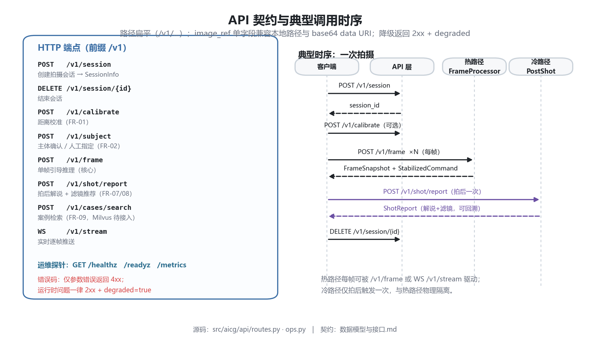

# 数据模型与接口

> 项目：AI 实时构图指导 Agent　|　版本：**v0.2（已实现）**　|　更新：2026-09-28
>
> **标注约定**：`待确认` = 字段/取值未定；`TODO` = 待补充；`✅ 已实现` = 代码已落地于 `src/aicg/`。
>
> 🟢 **v0.2 说明**：M0–M3 已交付，本版把 M0 阶段的"契约草案"回填为**实际实现契约**。表头中的状态列已更新为真实情况；与代码不一致之处以代码为准，并须回头修订本文档。
>
> **实际代码位置**（与草案阶段的命名有出入，此处为准）：
> `src/aicg/schemas/perception.py` · `src/aicg/schemas/composition.py` · `src/aicg/schemas/snapshot.py`
> · `src/aicg/schemas/session.py`
>
> ⚠️ 草案里的 `schemas/command.py` **未落地**：指令相关契约（`ActionType` /
> `StabilizedCommand` / `SuppressReason`）实际定义在 `schemas/session.py` 中。

---

## 1. 契约总原则

| 原则 | 说明 |
| --- | --- |
| 单一数据源 | 层间数据交换**只能**通过本文档定义的模型 |
| 显式单位 | 所有数值字段须在描述中标注单位（ms / m / ratio / px） |
| 显式坐标系 | 所有 `bbox` 须声明坐标系与格式 |
| 可溯源 | 每个输出字段应能追溯到上游模型或规则 |
| 版本化 | 契约变更须更新 `schema_version` 并记入 [CHANGELOG.md](./CHANGELOG.md) |
| 空值语义 | 不可用字段用 `null`，禁止用 `-1` / `"unknown"` 等魔法值 |

### 1.1 基础类型约定

| 类型 | 定义 | 状态 |
| --- | --- | --- |
| `BBox` | `[x1, y1, x2, y2]`，**归一化 0~1，原点左上** | ✅ 已定（M1） |
| `Point` | `[x, y]`，归一化 0~1 | ✅ 已定 |
| `Ratio` | `float`，取值 0.0~1.0 | ✅ 已定 |
| `Score` | `float`，**0.0~1.0**（加权和，各子项均归一到 0~1） | ✅ 已定 |
| 时间戳 | Unix 毫秒（int），从会话起始计时也可 | ✅ 已定 |
| 语言 | 输出文本默认中文 | ✅ 已定 |

> **为什么选归一化而非绝对像素**：候选框搜索与所有规则（三分线、平衡、留白、占比）本质都是比例关系，用归一化坐标可让评分器完全脱离分辨率，910×512 与 1920×1080 得到同一结论。绝对像素只在渲染叠加层时才由渲染器乘回去。

### 1.2 坐标归一化带来的一个真实陷阱

`scorer._score_candidate()` 在搜索候选框时会**以候选框自身**构造局部参考系。M2 阶段出现过一类缺陷：把 `subject_bbox == candidate_bbox` 当成参考系，导致"主体相对画面"的几何量全部退化为 0，评分维度变成常数（详见 [测试与验收.md](./测试与验收.md) §6 D-01/D-02）。

因此规则层函数**必须显式区分三个框**：

| 形参 | 含义 | 参考系 |
| --- | --- | --- |
| `subject_bbox` | 主体框（画面坐标） | 被评价对象 |
| `candidate_bbox` | 候选画框（裁剪后坐标） | 裁剪范围 |
| `frame_bbox` | 画面边界（默认 `(0,0,1,1)`） | **几何参考基准** |

这是 v0.2 契约的关键补充：**任何涉及"相对画面位置"的规则函数都必须接受独立的 `frame_bbox`，不得用 `candidate_bbox` 冒充参考系**。

---

## 2. 核心数据结构

> 以下为 Pydantic 风格的字段草案（**非最终代码**）。

### 2.1 感知层输出 `PerceptionResult`

对应模块：`perception/types.py`　对应需求：FR-02

| 字段 | 类型 | 必填 | 说明 | 状态 |
| --- | --- | --- | --- | --- |
| `frame_id` | int | ✅ | 帧序号 | 已定 |
| `timestamp_ms` | int | ✅ | 帧时间戳 | 待确认 |
| `frame_size` | `[int, int]` | ✅ | `[宽, 高]`，单位 px | 已定 |
| `subjects` | `list[Subject]` | ✅ | 检测到的主体列表，空列表表示未检测到 | 已定 |
| `faces` | `list[FaceInfo]` | ❌ | 人脸与关键点 | 已定 |
| `saliency_map_ref` | str \| null | ❌ | 显著性图存储引用（不内联大数组） | 待确认 |
| `depth_map_ref` | str \| null | ❌ | 深度图引用（可选能力） | 待确认 |
| `perception_ms` | float | ✅ | 本层耗时，单位 ms | 已定 |
| `model_versions` | `dict[str, str]` | ✅ | 各模型版本，用于可复现 | 已定 |

**`Subject`**

| 字段 | 类型 | 必填 | 说明 |
| --- | --- | --- | --- |
| `subject_id` | str | ✅ | 帧内唯一标识 |
| `label` | str | ✅ | 类别（person / animal / object …） |
| `bbox` | BBox | ✅ | 主体框 |
| `confidence` | Ratio | ✅ | 置信度 0~1 |
| `is_primary` | bool | ✅ | 是否为当前选定主体 |
| `source` | enum | ✅ | `auto` \| `manual`（对应 FR-02 人工兜底） |

**`FaceInfo`**

| 字段 | 类型 | 必填 | 说明 |
| --- | --- | --- | --- |
| `bbox` | BBox | ✅ | 人脸框 |
| `landmarks_ref` | str \| null | ❌ | 关键点引用 |
| `yaw_deg` | float \| null | ❌ | 朝向偏航角，用于判断是否正脸 |
| `pitch_deg` | float \| null | ❌ | 俯仰角 |

---

### 2.2 距离校准结果 `CalibrationResult`

对应模块：`pipeline/calibration.py`　对应需求：FR-01

| 字段 | 类型 | 必填 | 说明 | 状态 |
| --- | --- | --- | --- | --- |
| `current_distance_m` | float \| null | ✅ | 当前估距，单位 m；无法估算时为 null | 已定 |
| `min_distance_m` | float | ✅ | 建议最近距离 | 待确认（取值策略） |
| `max_distance_m` | float | ✅ | 建议最远距离 | 待确认 |
| `position_ratio` | Ratio | ✅ | 当前距离在区间内的位置 0~1，用于滑条可视化 | 已定 |
| `is_in_range` | bool | ✅ | 是否在建议区间内 | 已定 |
| `advice_text` | str | ✅ | 面向用户的提示文案 | 已定 |
| `estimation_method` | enum | ✅ | `bbox_height_ratio` \| `depth_map` | 已定 |
| `error_margin` | Ratio \| null | ❌ | 估算误差范围（如 ±0.3） | 待确认 |

> **估算公式**（对应 FR-01）：
> `distance ≈ (真实人体高度 H) / (框高像素 / 画面高像素) × 焦距相关常数`
> 其中 `H` 的默认假设值、焦距常数 `待确认`（需按机型标定）。

---

### 2.3 构图评估结果 `CompositionResult`

对应模块：`composition/types.py`　对应需求：FR-03

| 字段 | 类型 | 必填 | 说明 | 状态 |
| --- | --- | --- | --- | --- |
| `composition_score` | Score | ✅ | 构图总分，**0.0~1.0** | ✅ 已实现 |
| `sub_scores` | `dict[str, float]` | ✅ | 6 个子维度分（见下表） | ✅ 已实现 |
| `weights` | `dict[str, float]` | ✅ | 各维度实际权重（随配置，便于溯源） | ✅ 已实现 |
| `pattern` | `CompositionPattern` | ✅ | 当前构图模式（机器可读 key） | ✅ 已实现 |
| `pattern_label` | str | ✅ | 构图模式的中文标签（如"待定"/"对称构图"），**由 API 层生成，避免前端硬编码映射** | ✅ 已实现 |
| `shot_size_label` | str | ✅ | 景别中文标签（如"七分身"/"半身"），直接用于解说与 UI | ✅ 已实现 |
| `best_bbox` | BBox \| null | ✅ | 候选搜索得到的最优画框（归一化） | ✅ 已实现 |
| `best_score` | Score \| null | ✅ | 最优框对应分数 | ✅ 已实现 |
| `candidate_count` | int | ✅ | 候选框数量 | ✅ 已实现 |
| `rule_violations` | `list[RuleViolation]` | ✅ | 规则校验未通过项 | ✅ 已实现 |
| `decision_ms` | float | ✅ | 本层耗时 ms | ✅ 已实现 |

**`sub_scores` 的 6 个子维度（v0.2 实际权重）**

| 子维度 key | 中文 | 权重 | 计算依据 | 备注 |
| --- | --- | --- | --- | --- |
| `rule_of_thirds` | 三分法符合度 | **0.30** | 主体重心到最近三分线/点的距离 | 与 `pattern` 判定共享几何量 |
| `subject_scale` | **主体占比** | **0.22** | 主体框高 / 画面高，理想值 `ideal_subject_height` | 🆕 v0.2 新增，见下方说明 |
| `balance` | 画面平衡 | **0.18** | 四向留白是否均匀（vs 画面边界） | ⚠️ 曾因参考系错误恒为 0，已修复 |
| `headroom` | 头顶留白 | **0.16** | 主体顶部到候选框顶部的间隙比例，理想 0.12 | ⚠️ 曾因参考系错误恒为 0.6，已修复 |
| `lead_room` | 视线留白 | **0.12** | 主体朝向侧预留空间 | 无朝向信息时退化为对称评估 |
| `saliency_center` | 显著性居中 | **0.12** | 显著区域重心偏离画面中心程度 | — |

> 权重之和 = 1.10（故意 >1，因为下面还有一个"门控项"参与乘法）。

**门控项 `subject_center`（不是子维度，而是乘数）**

| 项 | 作用 | 公式 |
| --- | --- | --- |
| `subject_center` | 主体是否落在画面内 | `multiplier = 0.35 + 0.65 × subject_center` |

最终得分：`composition_score = (Σ wᵢ × subᵢ) × (0.35 + 0.65 × subject_center)`

设计意图：主体跑出画面时，前面所有"构得好不好"的讨论都失效——因此用乘法门控硬压分，而不是把 `subject_center` 当成又一个可被其他维度补偿的加权项。

**🆕 `subject_scale` 为什么必须存在（v0.2 新增）**

M2 的评测暴露出真实缺陷：一个只占画面高度 **1%** 的"远处小人"和一个占 **44%** 的"标准半身像"，在旧版 5 维评分下**得分完全相同**。这直接让 FR-01（"主体太小 → 建议走近"）失去了评分依据——系统会说"构图不错，保持"，而画面上的人还不到拇指大。

评分曲线（`ideal_subject_height = 0.55`，`floor = 0.15`）：

| 主体高度占比 `h` | 得分 | 行为 |
| --- | --- | --- |
| `h ≥ 0.55` | **1.00** | 主体足够大，满分 |
| `0.15 ≤ h < 0.55` | `0.25 + 0.75 × (h - 0.15)/(0.55 - 0.15)` | 线性爬升（0.25 → 1.00） |
| `h < 0.15` | `0.25 × (h / 0.15)` | **陡降**：主体过小重罚 |

> ⚠️ **该维度的已知局限**：在合成评测夹具上，YOLO 会把"被裁掉一半的人"外扩到接近满框，导致 `subject_scale` 在 5 张评测图上**全部读到 1.00**，失去了区分度。也就是说，SRCC 的提升主要来自位置类维度，而非占比维度。此局限已记录于 `configs/eval/annotations.json::known_limitation` 与 [测试与验收.md](./测试与验收.md) §4.1。

**`CompositionPattern`**（枚举，FR-03）

| 取值 | 含义 | 状态 |
| --- | --- | --- |
| `rule_of_thirds` | 三分法 | 已定 |
| `center` | 中心构图 | 已定 |
| `symmetric` | 对称构图 | 已定 |
| `diagonal` | 对角线构图 | 已定 |
| `framing` | 框架式构图 | 已定 |
| `unknown` | 无法判定 | 已定 |

> `待确认`：是否需要更细粒度（如"右三分 + 七分身"的位置/景别二级标注）。

**`RuleViolation`**

| 字段 | 类型 | 说明 |
| --- | --- | --- |
| `rule` | enum | `thirds_alignment` \| `margin_ratio` \| `subject_placement` … |
| `severity` | enum | `info` \| `warn` \| `error` |
| `detail` | str | 人可读说明 |

---

### 2.4 动作指令 `ActionCommand`

对应模块：`composition/differ.py`　对应需求：FR-04

| 字段 | 类型 | 必填 | 说明 | 状态 |
| --- | --- | --- | --- | --- |
| `action` | `ActionType` | ✅ | 动作类型 | 已定 |
| `direction` | `Direction` \| null | ❌ | 方向（部分动作无方向） | 已定 |
| `magnitude_text` | str | ✅ | 差分量文本，如"约 1.7 米" | 已定 |
| `magnitude_raw` | float \| null | ❌ | 差分原始数值（归一化或像素） | 待确认 |
| `urgency` | enum | ❌ | `low` \| `medium` \| `high` | 待确认 |
| `is_hold` | bool | ✅ | 是否为"保持不动" | 已定 |
| `confidence` | Ratio | ✅ | 指令置信度 | 已定 |
| `can_skip` | bool | ✅ | 是否允许"就这样构图"跳过（FR-12） | 已定 |

**`ActionType`**

| 取值 | 含义 |
| --- | --- |
| `move_closer` | 前进 |
| `move_back` | 后退 |
| `move_left` | 左移 |
| `move_right` | 右移 |
| `tilt_up` | 仰拍 |
| `tilt_down` | 俯拍 |
| `hold` | 保持 |

---

### 2.5 防抖后指令 `StabilizedCommand`

对应模块：`stabilization/debouncer.py`　对应需求：FR-06

| 字段 | 类型 | 说明 | 状态 |
| --- | --- | --- | --- |
| `command` | ActionCommand | 防抖后的指令 | 已定 |
| `raw_command` | ActionCommand | 防抖前的原始指令 | 已定 |
| `is_changed` | bool | 本次是否发生切换 | 已定 |
| `suppressed_by` | enum \| null | 被抑制原因：`ema` \| `n_frame_consensus` \| `min_interval` | 已定 |
| `consecutive_frames` | int | 当前指令已连续命中的帧数 | 已定 |
| `since_last_change_ms` | float | 距上次切换的毫秒数 | 已定 |

---

### 2.6 结构化中间表示 `FrameSnapshot`

**这是本项目最核心的契约**（NFR-O1）。它串联感知、决策、防抖三层输出，是"建议可溯源"的载体。

对应模块：`schemas/composition.py` / `schemas/command.py`

| 字段 | 类型 | 必填 | 说明 |
| --- | --- | --- | --- |
| `schema_version` | str | ✅ | 契约版本号，如 `"0.1"` |
| `frame_id` | int | ✅ | 帧序号 |
| `timestamp_ms` | int | ✅ | 帧时间戳 |
| `perception` | PerceptionResult | ✅ | 感知层输出 |
| `composition` | CompositionResult | ✅ | 决策层输出 |
| `command` | StabilizedCommand | ✅ | 最终下发指令（**嵌套**，API 层会打平） |
| `latency` | LatencyBreakdown | ✅ | 分阶段耗时 |
| `degraded` | bool | ✅ | 本次是否走了降级路径 |
| `degradation_reason` | `DegradationReason` \| null | ❌ | 降级原因枚举（NFR-R2） |
| `backend` | str | ✅ | 实际使用的感知后端（`yolo` / `rule`）——用于溯源「这帧是谁算的」 |

**`LatencyBreakdown`**（NFR-P1 / NFR-O4）

| 字段 | 类型 | 说明 |
| --- | --- | --- |
| `capture_ms` | float | 取帧耗时 |
| `perception_ms` | float | 感知耗时（**热路径瓶颈，占 ~99%**） |
| `decision_ms` | float | 构图层（评分+候选搜索）耗时 |
| `stabilization_ms` | float | 防抖层耗时（**独立拆出**，避免与决策混算） |
| `total_ms` | float | 上述之和 |
| `language_ms` | float \| null | 语言层耗时——**不在 `LatencyBreakdown` 内**，而是挂在 `narration.language_ms`（冷路径，不进热路径预算） |

> **为什么把 `stabilization_ms` 单独拆出来**：M2 阶段决策层与防抖层的耗时是合并统计的，导致"防抖是不是延迟元凶"这个问题无法回答。拆开后实测证明防抖耗时约 **0.04ms**，可忽略——**拆分的价值不在于数字本身，而在于让"该不该优化它"这个问题有了确定答案**。

---

### 2.7 拍后解说 `ShotReport`

对应模块：`pipeline/postshot.py`　对应需求：FR-07 / FR-08

| 字段 | 类型 | 必填 | 说明 | 状态 |
| --- | --- | --- | --- | --- |
| `shot_id` | str | ✅ | 拍摄唯一标识 | 已定 |
| `composition_narration` | str | ✅ | 构图理念解说，如"采用右三分七分身构图…" | 已定 |
| `filter_name` | str \| null | ❌ | 推荐滤镜名 | 待确认（命名风格） |
| `filter_reason` | str \| null | ❌ | 滤镜推荐理由 | 已定 |
| `tts_audio_ref` | str \| null | ❌ | 语音文件引用（P2） | 待确认 |
| `input_snapshot` | FrameSnapshot | ✅ | 生成解说所依据的快照，保证可溯源 | 已定 |
| `prompt_version` | str | ✅ | 所用 prompt 模板版本 | 已定 |
| `vlm_model` | str | ✅ | 所用 VLM 名称与版本 | 已定 |
| `token_usage` | `TokenUsage` \| null | ❌ | Token 消耗（对应 NFR-E3 成本指标） | 已定 |

---

### 2.8 案例检索 `CaseSearchResult`

对应模块：`retrieval/search.py`　对应需求：FR-09

| 字段 | 类型 | 说明 | 状态 |
| --- | --- | --- | --- |
| `case_id` | str | 案例唯一标识 | 已定 |
| `image_ref` | str | 图片引用 | 已定 |
| `similarity` | Ratio | 相似度 | 已定 |
| `pattern` | CompositionPattern | 该案例构图模式 | 已定 |
| `scene_tags` | `list[str]` | 场景标签（目录 + 文件名推断，上限 8 个） | ✅ 已定 |
| `description` | str \| null | 案例说明（景别 + 模式文案自动拼接） | 已定 |

**Milvus Collection 设计**（FR-09，M6-2 全部敲定）

决策依据与方案对比见 `docs/research/Milvus本地方案调研.md`。

| 项 | 内容 | 状态 | 决策理由 |
| --- | --- | --- | --- |
| Collection 名 | `composition_cases` | ✅ 已定 | — |
| 向量维度 | **8** | ✅ 已定 | 可解释构图特征（见下），非黑盒 embedding |
| 向量来源 | 感知 + 评分器已产出的构图特征 | ✅ 已定 | 复用既有链路、**零新增模型**；CLIP 双塔需数百 MB 重依赖，违背镜像最小化纪律 |
| 8 维构成 | `thirds` / `subject_scale` / `balance` / `headroom` / `lead_room` / `saliency_center` / `subject_height` / `center_offset_x`（全部 [0,1]） | ✅ 已定 | 前 6 维取自 `CompositionResult.sub_scores`，后 2 维取自主体框几何；次序由 `retrieval/features.py:DIM_NAMES` 单点定义 |
| 标量字段 | `case_id`(PK, VARCHAR64) / `pattern`(VARCHAR32) / `scene_tags`(ARRAY\<VARCHAR\>, cap 8) / `image_ref`(VARCHAR512) / `description`(VARCHAR1024) | ✅ 已定 | `source` 字段取消：素材 100% 来自 `assets/`，单来源无过滤价值 |
| 索引类型 | HNSW（M=16, efConstruction=200, ef=64） | ✅ 已定 | 案例库 ≤ 数百条；HNSW 查询延迟最低，IVF_FLAT 在小数据上无优势 |
| 距离度量 | COSINE | ✅ 已定 | 特征全部有界非负，余弦即"构图风格相似度"；`similarity = clamp(1 - distance, 0, 1)` |

**`query_text` 的角色（诚实降级）**：仅做 `pattern` 标量过滤（关键词映射，见
`retrieval/search.py:pattern_from_text`），**不做文本语义检索**——那是 CLIP 双塔
的能力。纯文本请求返回 `200 + degraded=true + text_embedding_unavailable`。

**降级枚举**（全部 200 + degraded，绝不 5xx，NFR-R1）：
`pymilvus_unavailable` / `connection_failed` / `perception_failed` / `no_subject` /
`text_embedding_unavailable` / `search_failed` / `collection_create_failed` /
`dimension_mismatch`。降级原因有**优先级**：感知失败 > 无主体 > 存储失败。

---

## 3. 接口约定

### 3.0 端点清单与调用时序



图中左侧是全部端点，右侧是一次拍摄的完整时序。**注意虚线箭头**（响应方向）
与紫色部分（冷路径）——`/v1/shot/report` 是唯一会触发 VLM 的端点，
它**不参与**每帧热路径。

### 3.1 接口总览

| 编号 | 方法 | 路径 | 用途 | 需求 | 状态 |
| --- | --- | --- | --- | --- | --- |
| API-01 | POST | `/v1/session` | 创建拍摄会话 | FR-05 | ✅ 已实现 |
| API-02 | DELETE | `/v1/session/{session_id}` | 结束会话 | FR-05 | ✅ 已实现 |
| API-03 | POST | `/v1/calibrate` | 距离校准 | FR-01 | ✅ 已实现 |
| API-04 | POST | `/v1/subject` | 主体确认（支持人工指定） | FR-02 | ✅ 已实现 |
| API-05 | POST | `/v1/frame` | 单帧引导推理（**核心**） | FR-03/04/05/06 | ✅ 已实现 |
| API-06 | WS | `/v1/stream` | 流式引导（WebSocket） | FR-05 | ✅ 已实现 |
| API-07 | POST | `/v1/shot/report` | 拍后解说 + 滤镜 | FR-07/08 | ✅ 已实现 |
| API-08 | POST | `/v1/cases/search` | 案例检索 | FR-09 | ✅ 已实现（M6-2；Milvus 不可用时 200 + degraded） |
| API-09 | GET | `/healthz` | 存活探针（**不构建感知**） | NFR-R4 | ✅ 已实现 |
| API-10 | GET | `/readyz` | 就绪探针（**会构建感知**） | NFR-R4 | ✅ 已实现 |
| API-11 | GET | `/metrics` | Prometheus 文本指标 | NFR-O3 | ✅ 已实现 |
| API-12 | GET | `/` | Web 演示页（静态托管） | 交付物 | ✅ 已实现 |

> **路径形态说明**：M0 草案即采用**扁平路径**（`/v1/session`、`/v1/frame`），实现时保持不变——路由内部通过请求体里的 `session_id` 关联会话，而非路径参数。选扁平路径的理由：单帧推理是**高频热路径**，请求体携带 `session_id` 可让 URL 保持稳定、便于 CDN/代理层做统一的路径级缓存与限流策略。
>
> `session_id` 出现在 `/v1/session/{session_id}`（DELETE）的路径中，是因为该操作**只针对单个会话**、无请求体；其余操作都通过请求体传 `session_id`。
>
> **探针三件套（`api/ops.py`，不带 `/v1` 前缀，属运维面）**：
> - `/healthz`（liveness）只回"进程活着"，**绝不触发模型加载**——否则一个探针就能把 6.3s 的 YOLO 冷启动成本反复引入。
> - `/readyz`（readiness）才检查感知后端是否可用，决定"能否接业务流量"。
> - `/metrics` 输出 Prometheus 文本格式，**不引入 `prometheus_client` 依赖**（纯文本拼接，减少依赖面）。

> **端点计数**：**10 个 REST 端点**（9 个 JSON + 3 个运维探针中的 `/healthz`/`/readyz`/`/metrics` 计 3 个，业务 JSON 端点 7 个）+ **1 个 WebSocket**。以上均可在 `GET /openapi.json` 与 `app.routes` 中核实。

### 3.2 核心接口详述：`POST /v1/frame`

**请求**

```json
{
  "session_id": "s-8f3a1c",
  "frame_id": 1024,
  "timestamp_ms": 1759038000000,
  "image_ref": "data:image/png;base64,iVBORw0KGgo...",
  "subject_override": null,
  "enable_language": false
}
```

| 字段 | 类型 | 必填 | 说明 | 状态 |
| --- | --- | --- | --- | --- |
| `session_id` | str | ✅ | 会话标识 | ✅ 已实现 |
| `frame_id` | int | ✅ | 帧序号 | ✅ 已实现 |
| `timestamp_ms` | int | ✅ | 帧时间戳（Unix 毫秒） | ✅ 已实现 |
| `image_ref` | str | ✅ | **图像引用**：本地路径 **或** base64 data URI | ✅ 已实现 |
| `subject_override` | `[f,f,f,f]` \| null | ❌ | 人工指定主体框（归一化 4 元组），覆盖自动检测（FR-02 兜底） | ✅ 已实现 |
| `enable_language` | bool | ❌ | 是否触发语言层（成本控制，NFR-E3），**默认 false** | ✅ 已实现 |

> **图像传输决策（M0 遗留项，已敲定：单字段双形态）**：实现时把 base64 与本地路径**合并到一个 `image_ref` 字段**，而不是拆成两个互斥字段。服务端按前缀判定：
> - `data:image/...;base64,` 前缀 → 视为内联数据，解码使用。
> - 其他字符串 → 视为本地路径，直接读取。
>
> 这么做的原因：**减少一个"二选一必填"的校验分支**（原设计需要校验"二者必须且只能给一个"，是个容易写错的校验逻辑）。单字段方案让 Pydantic 只需一个 `str` 必填项，语义由前缀自解释。
>
> - ⚠️ **简化处**：生产环境应改为**对象存储 + 预签名 URL**，避免大图 base64 导致请求体膨胀 ~33%、且占用一次完整内存拷贝。

**响应（真实结构 — 以下为实测原样输出，非示意）**

> 该样例来自"无主体"降级路径，因此 `composition_score = 0.0`、`subject = null`、`degraded = true`。刻意选这个样例是因为**它最能暴露契约的真实形态**：`sub_scores` 为空对象、`rule_violations` 携带中文说明、`command` 是 `hold`、`narration` 走兜底。

```json
{
  "schema_version": "0.1",
  "frame_id": 0,
  "timestamp_ms": 0,
  "frame_size": [910, 512],
  "command": {
    "action": "hold",
    "direction": "hold",
    "magnitude_text": "保持",
    "magnitude_raw": 0.0,
    "urgency": "low",
    "is_hold": true,
    "confidence": 0.0,
    "can_skip": true,
    "is_changed": true,
    "raw_action": "hold",
    "suppressed_by": null,
    "consecutive_frames": 1,
    "since_last_change_ms": 0.0,
    "smoothing": 0.0
  },
  "composition": {
    "composition_score": 0.0,
    "pattern": "unknown",
    "pattern_label": "待定",
    "shot_size_label": "七分身",
    "best_bbox": [0.34, 0.3, 0.66, 0.86],
    "best_score": 0.0,
    "candidate_count": 0,
    "sub_scores": {},
    "rule_violations": [
      { "rule": "thirds_alignment", "severity": "info", "detail": "未识别到可靠主体" }
    ],
    "degraded": true
  },
  "subject": null,
  "latency": {
    "capture_ms": 0.0,
    "perception_ms": 7580.95,
    "decision_ms": 0.14,
    "stabilization_ms": 0.04,
    "total_ms": 7581.13
  },
  "degraded": true,
  "degradation_reason": "subject_detection_failed",
  "backend": "yolo",
  "narration": {
    "text": "当前画面尚未识别到明确主体，建议先用三分法把主体安排在画面三分之一处。...",
    "is_fallback": true,
    "model": "mock",
    "prompt_version": "v1",
    "language_ms": 0.03
  }
}
```

**与 §2.6 `FrameSnapshot` 的对应关系**：接口响应不是 `FrameSnapshot` 的逐字段镜像，而是 **API 层为前端便利性做的展开**（`api/mappers.py::snapshot_to_response`）。关键差异：

| 差异点 | `FrameSnapshot`（内部） | API 响应 |
| --- | --- | --- |
| 命令 | `StabilizedCommand{command, raw_command, ...}` 嵌套 | **打平**为单一 `command` 对象，附加 `raw_action` 字段保留原始动作 |
| 防抖信息 | 独立字段 | 合并进 `command`（`is_changed` / `suppressed_by` / `consecutive_frames` / `smoothing`） |
| 主体 | `perception.subjects[]` 列表 | **只暴露 `is_primary` 的那一个**为 `subject`，可为 `null` |
| 解说 | 不在 `FrameSnapshot` 内（冷路径产物） | 展开为 `narration` 对象（含 `is_fallback` / `model` / `language_ms`） |
| 后端标记 | 无 | 新增 `backend`（`yolo` / `rule`），便于前端与日志判断用了哪条路 |
| 延迟 | `LatencyBreakdown` | **多一个 `stabilization_ms`**，把防抖耗时单独拆出 |

> ⚠️ **`latency.perception_ms = 7580ms` 是冷启动首帧**。预热后稳态为 20–28ms（见 §4）。该样例刻意保留了冷启动数字，以说明"`latency` 字段必须按实际测量填，不能填理想值"。

### 3.3 接口通用约定（M0 遗留项，已敲定）

| 约定项 | 内容 | 状态 |
| --- | --- | --- |
| 版本前缀 | `/v1` | ✅ 已定 |
| 认证方式 | 无（本地 Demo 定位） | ✅ 已定 |
| 错误响应格式 | FastAPI 默认 `{"detail": ...}` | ✅ 已定 |
| 错误码体系 | **参数类错误返 4xx；业务降级返 2xx + `degraded=true`** | ✅ 已定 |
| 超时 | 无服务端硬超时（单帧 P95 ≈24–28ms，远低于任何合理阈值） | ✅ 已定 |
| 幂等 | 单帧推理天然幂等（除会话状态） | ✅ 已定 |
| 限流 | 无（单用户 Demo） | ✅ 已定 |
| 帧图像传输 | 单字段 `image_ref`：本地路径 **或** base64 data URI | ✅ 已实现 |
| CJK 支持 | HTTP/JSON 层完整支持 UTF-8 中文；**仅录屏视频的字幕受限**（OpenCV Hershey 无 CJK 字形） | ✅ 已定 |
| 同步路由模型 | CPU 密集路由用 **`def`**（非 `async def`），由 FastAPI 自动移交线程池 | ✅ 已定 |

> **"业务降级返 2xx"的理由**：如果 YOLO 没检测到主体就返 500，客户端会把它当成"服务坏了"而重试/报错，但真实情况是"这帧确实没有主体，请提示用户长按指定"。用 `degraded=true` + `degradation_reason` 表达，语义才正确。**只有客户端参数非法（如两个图像字段都为空、base64 解码失败）才返 4xx**。这条约定与 NFR-R1"宁可降级不可崩溃"一致。

### 3.4 降级响应约定（NFR-R1/R2）

任何一层失败时，接口**必须返回可用响应**而非 5xx，通过以下字段表达降级。
`degradation_reason` 是**枚举**（`schemas/snapshot.py::DegradationReason`），取值封闭：

| 枚举值 | 场景 | 行为 |
| --- | --- | --- |
| `subject_detection_failed` | 主体检测失败 | `subject = null`，`command = hold`，解说提示长按指定主体 |
| `composition_model_unavailable` | 构图模型不可用 | 降级为通用三分法引导 |
| `distance_estimation_failed` | 距离无法估算 | `current_distance_m = null`，仅给方向 |
| `weights_missing` | 模型权重缺失 | 感知层静默降级为 `rule` 后端（`backend` 字段会体现） |
| `timeout` | 单帧推理超时 | 返回降级响应而非挂起 |
| `unknown` | 未分类异常 | 兜底值，出现即表示需补分类 |

**降级路径的 `degraded` 标记规则**：

| 场景 | `degraded` | 说明 |
| --- | --- | --- |
| 上述任一枚举 | **true** | 主流程降级 |
| 语言层调用失败（解说走兜底） | **false** | **不算主流程降级**——`narration.is_fallback = true` 单独表达。引导本身完好，不应污染 `degraded` 语义 |
| 图像解码失败 / 字段缺失 | — | **4xx**（客户端参数错误，唯一不降级的场景） |

---

## 4. 数据存储

| 数据 | 存储 | 状态 |
| --- | --- | --- |
| 案例向量 | Milvus | ✅ 已定（M4 接入） |
| 案例元数据 | PostgreSQL + SQLAlchemy（M4） | ✅ 已定 |
| 会话状态 | **进程内 dict**（`SessionStore` 接口已预留，可换 Redis） | ✅ 已实现（简化） |
| 指标统计 | `outputs/` 下 JSON 报告 + 结构化日志 | ✅ 已实现 |
| 运行产物 | 本地 `outputs/`（视频 / 截图 / 报告） | ✅ 已实现 |

> **会话存储的简化与生产做法**：当前 `SessionStore` 是进程内字典，服务重启即丢失，且无法多实例水平扩展。之所以敢这么做：单用户 Demo 场景下，会话生命周期 = 一次拍摄（分钟级），无跨实例需求。
>
> 生产环境必须改为 **Redis**（或独立会话服务），原因有三：① 多实例部署需共享会话；② 用户可能跨设备续拍；③ 重启不应丢数据。代码层已经把会话读写收敛到 `SessionStore` 单一入口，替换实现只需换一个类，**不动路由层**——这是刻意的可替换性设计。

---

## 5. 契约变更流程

1. 修改本文档对应字段，标注状态与变更原因
2. 更新 `schema_version`
3. 追加至 [CHANGELOG.md](./CHANGELOG.md)，标注是否破坏性变更
4. 同步更新 `schemas/` 下代码与测试
5. 破坏性变更须在提交信息中标注 `BREAKING CHANGE:`

---

## 6. 待确认清单

### 6.1 已在 M0–M3 期间敲定（移出待确认）

- [x] `BBox` 坐标系 → **归一化 0~1，原点左上**
- [x] 时间戳精度与基准 → **Unix 毫秒（int）**
- [x] `composition_score` 的取值域 → **0.0~1.0**
- [x] `magnitude_raw` 的归一化方式 → 归一化 0~1（差分位移量）
- [x] 帧图像传输方式 → **单字段 `image_ref`**（本地路径 / base64 data URI 双形态，按前缀判别）
- [x] 认证与限流策略 → **无认证、无限流**（本地 Demo）
- [x] 错误码体系 → **参数错误 4xx；业务降级 2xx + `degraded=true`**
- [x] 会话状态存储方式 → **进程内 dict（`SessionStore` 可替换 Redis）**
- [x] API 路径 → **保持 M0 草案的扁平形态**（`/v1/frame` 等，`session_id` 走请求体）
- [x] 健康检查 → **`/healthz`（存活）与 `/readyz`（就绪）分离**
- [x] Milvus Collection 全部细节（M6-2 敲定）→ **8 维可解释构图特征 + HNSW + COSINE**，
      字段名/类型/容量见 §2.8；`source` 字段取消（单来源无过滤价值）
- [x] `scene_tags` 标签体系 → **目录 + 文件名关键词推断**（`cafe` / `selfie` /
      `street` / `travel` / `big_closeup` / `half_body` …，上限 8 个）

### 6.2 仍未决（TODO）

- [ ] 构图模式是否需要二级标注（位置 + 景别）
- [ ] `urgency` 的判定规则
- [ ] 建议距离区间的取值策略（固定 vs 按景别动态）
- [ ] 滤镜命名风格
- [ ] 案例元数据存储方式（PostgreSQL 表结构）—— 本期用 Milvus 标量字段承载，
      PostgreSQL 关系表列为后续增强（案例库规模上千后再拆）
- [ ] `magnitude_text` 的措辞模板是否需要口语化随机化
- [ ] 真实标注评测集规模与标注规范

---

## 7. v0.2 契约变更记录（对 [CHANGELOG.md](./CHANGELOG.md) 的索引）

> 本节记录 **M0 草案 → M3 实现** 之间契约的实际变化。经与 `GET /openapi.json` + `app.routes` 逐项核对后确认。

| 变更 | 类型 | 说明 |
| --- | --- | --- |
| API 路径形态 | **无变更** | 保持 M0 草案扁平形态（`/v1/frame` 等）；**未**引入 `/{session_id}/` 路径参数，`session_id` 走请求体 |
| 图像字段合并 | **破坏性** | M0 草案的 `image`（含 b64/multipart/object_ref 三态）落地为单一 `image_ref`（本地路径 / base64 data URI，按前缀判别） |
| `CompositionResult` 新增 `subject_scale` / `weights` | 兼容 | 新增字段，旧客户端可忽略 |
| `CompositionResult` 新增 `pattern_label` / `shot_size_label` | 兼容 | 中文标签由后端生成，前端不再硬编码映射表 |
| `Command` 打平 + 新增 `raw_action` / `smoothing` | 兼容 | API 层把 `StabilizedCommand` 打平，附加防抖过程字段 |
| `LatencyBreakdown` 新增 `stabilization_ms` | 兼容 | 防抖耗时从决策耗时中拆出 |
| 规则函数新增 `frame_bbox` 形参 | **内部契约** | 修复参考系错误（D-01/D-02），签名变更影响 `rules.py` 全部调用方 |
| 新增 `GET /readyz`；`/metrics` 保留 | 兼容 | 二者职责不同：`/readyz` 是就绪探针，`/metrics` 是 Prometheus 文本 |
| 健康端点不带 `/v1` 前缀 | 兼容 | `/healthz` `/readyz` `/metrics` 属运维面 |
| 响应新增 `narration` 对象 | 兼容 | 便于 Web 轨直接展示；含 `is_fallback` / `model` / `language_ms` |
| `degradation_reason` 定型为枚举 | 兼容 | 封闭取值（6 个），见 §3.4 |
| `schema_version` | `"0.1"` 保持不变 | **未随里程碑提升**——契约实际未破坏性变更，无需 bump |

> ⚠️ **一个自我修正记录**：本文档 v0.2 初稿曾错误地写入"API 路径改为 `/v1/sessions/{sid}/frames`"与"`/metrics` 被 `/readyz` 取代"两条**与代码不符**的变更。经 `app.openapi()['paths']` 实测核对后已更正。**教训：契约文档必须以运行时 schema 为准，不能凭记忆或设计意图书写。** 核对方法：
>
> ```bash
> PYTHONPATH=src python -c "from aicg.api.app import create_app; from aicg.settings import load_settings; \
> import json; print('\n'.join(sorted(create_app(load_settings()).openapi()['paths'])))"
> ```
